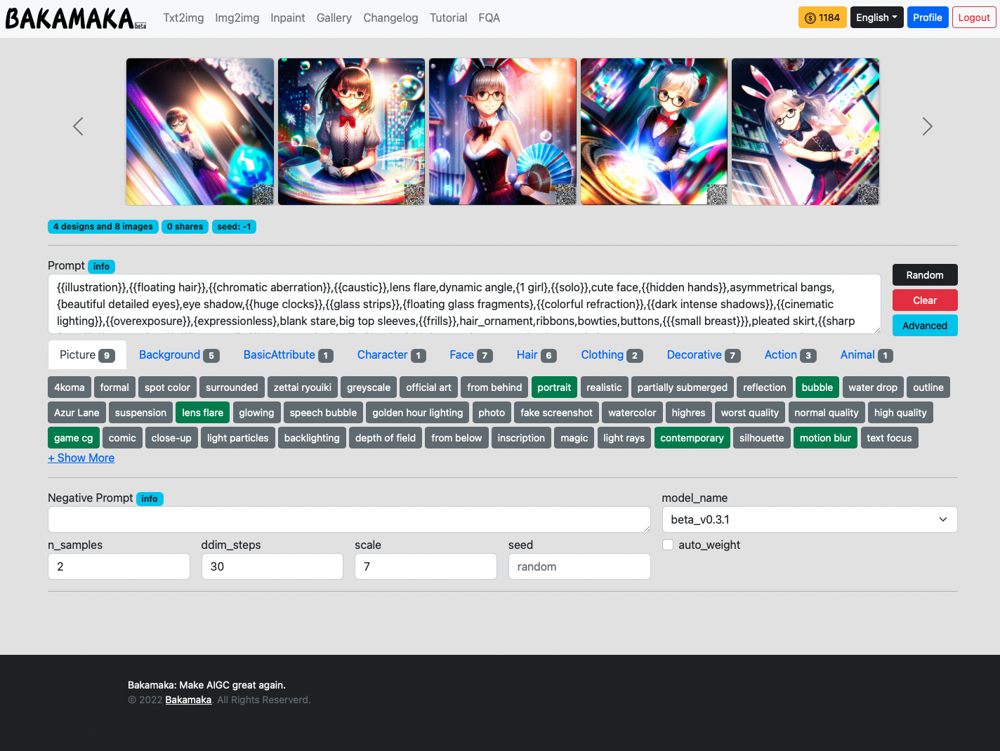

Txt2img  Interface  Introduction
########################################

1. Interface Overview
----------------------------------------

Navigation area
=======================================

   - Text to image: Generate an image through the descriptive vocabulary

   - Image generation: Generate an image by uploading a pre-defined image with a description vocabulary

   - Partial modifications: Generate images by selecting areas and describing the vocabulary

Personal information
=======================================

   - Remaining **inspiration points**

   - Languages

   - My Profile: see the history of the generation

   - Log out

1.1 Preview
----------------------------------------

   - The image generated will be displayed here.
   
   - When the page is first opened, some of our pre-defined images will be displayed here.

1.2 Description
----------------------------------------

   - Here you can edit and enter the descriptors you want（`guide <Prompt_course.html>`_）

1.3 Shortcut
----------------------------------------

   - Random: Some of the officially considered good "descriptors" will be added randomly into the description section.
   - Empty: Clicking on this button will empty all the descriptors in the description area.
   - Advanced: Clicking on this button will show/hide the "Reverse Description Area", "Model Selection Area", "Parameter Selection Area", "Image Parameter Area".

1.4 Pre-set tag list
----------------------------------------

 - We will pre-set some of the pre-set tags for the user to choose from here.

1.5 Reverse description
----------------------------------------

   - You can edit and enter the descriptors you want (tutorial on descriptors) here.

   - This function is mainly used when the AI plays randomly and may bring in various random contents, if you do not want it to appear in your painting.

1.6 Model selection
----------------------------------------

   - You can choose between different styles of models here (currently only one model is available)

1.7 Parameter selection
----------------------------------------
   - Number of images generated: the number of images generated in a single session
   - Number of steps to generate: the number of steps in a single calculation, 30-100 is recommended, the larger the value is, the finer the generated image will be and the more time it will consume
   - Text control strength:it is used to define how much control the description text has over the generated images. Generally around 7
   - Seed: when fixed, the same parameters will generate the same image each time
   - Automatic weighting: when selected, you can automatically weight some of the words in the description during the generation process, greatly improving the generation effect

1.8 Image parameters
----------------------------------------

   - Image Aspect ratio selection: the user can choose from three aspect ratios: 2:3, 1:1 and 3:2
   - Image Aspect selection: The different options represent the aspect resolution of the resulting image. M is for 768, L is for 1536, 3K is for 3072 and 6K is for 6144, the higher the resolution the higher the price of the generated image.
   - Generate button: Generate. The small number next to it represents the number of points needed to generate this image.

