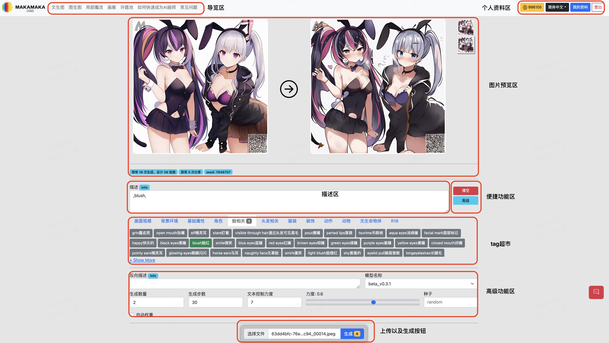
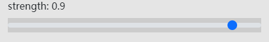

Img2img  Interface  Introduction
########################################

1.Interface Overview
----------------------------------------

** Navigation area
=======================================

   - Text to image: Generate an image by describing the vocabulary

   - Image to image: Generate an image by uploading a pre-defined image with a description words

   - Partial modifications: Generate images by selecting areas and describing words

** Personal information
=======================================

   - Remaining **inspiration points**

   - Language

   - My Profile: see the history of the generation

   - Log out

1.1 Preview
----------------------------------------

In the preview area you will be able to preview your uploaded image and the resulting image thumbnails.

- On the left hand side you will see the image you have uploaded and by default we will provide a demo for you to use

- On the right hand side you will see the final image generated by using the description vocabulary together with the original image

- You can switch between multiple images at the bottom right

1.2 Description
----------------------------------------

   - You can edit and enter the descriptors you want here（`guide <Prompt_course.html>`_）

1.3 Shortcut
----------------------------------------

   - Empty: Clicking on this button will empty all the descriptors in the "Description Area".
   - Advanced: Click on this button to show/hide the "Reverse description area", "Model selection area", "Parameter selection area", "Image parameter area".

1.4 Pre-set tag list
----------------------------------------

 - We will pre-set some of the pre-set tags for the user to choose from here.

1.5 Advanced function
----------------------------------------

- Reverse Description

   - Here you can edit and enter your desired descriptor（`tutorial on descriptors <Prompt_course.html>`_）

   - This function is mainly used when the AI is playing randomly, it may bring various random contents, if you do not want it to appear in your painting, you can enter here what you do not want to appear.

- Model selection area

    - Here you can select different styles of models (currently only one model is available)

- Generate quantity

    - The more you can generate, the more time and **inspiration points** you will need.

- Number of steps to generate

    - The higher the number, the more detailed the image will be and the more time it will take.

- Text control strength

    - Defines how much control the description text has over the generated image. Usually around 7

- Seed

    - Fixed, the same parameters will generate the same image each time

- Automatic weighting

    - When selected, some of the words in the description can be automatically weighted during the generation process, greatly improving the results.

- Strength

    - Strength defines the strength of the modification to the original image, the higher the value the higher the strength.

1.6 Upload and generate
----------------------------------------

- Upload

    - Images can be uploaded to the server and displayed in the preview area using this function

- Generate

    - Generate. The small number next to it represents the number of points needed for this generation.

    - The number of points is proportional to the number of images generated and the resolution of the generated images

1.7 Do it yourself!
----------------------------------------

Let's try it out with this image from the demo

.. image:: img/i2i_2.jpg
   :align: center
   :width: 300

We wanted to add a little **lens flare**

- lens flare

Note: A very critical parameter in I2I is **strength**

currently it is 0.9 

Let's have a try 

.. image:: img/i2i_4.jpg
   :align: center
   :width: 300

Well，it seems to be pushing too hard. Except for  lens flare, which is a bit different from the original image. It's okay, we change the strength parameter  to 0.6.

Remember what was mentioned above? The higher the **strength** value, the greater the modification.

.. image:: img/i2i_6.png
   :align: center
   :width: 300

Let's try to generate it again

.. image:: img/i2i_3.jpg
   :align: center
   :width: 300

OK, done, we added some effects to the original image.
