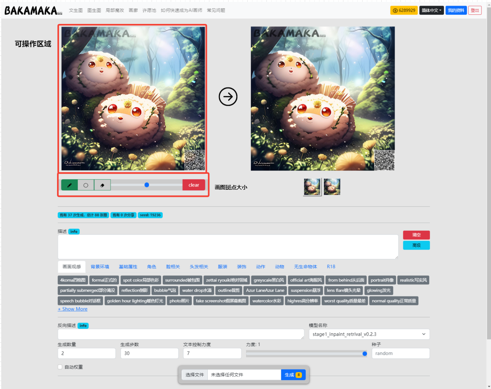

Inpaint Interface  Introduction
########################################

1.Interface Overview
----------------------------------------

.. note::

    The only difference between the **inpaint** and **Img2img** are in the editable operation, this introduction will not be introduced in other functions.

1.1 Operation area
----------------------------------------

With this function, users can click the mouse directly in this area and swipe to modify the area

.. image:: img/inpaint_tu_tu2.png
   :align: center
   :width: 300

.. image:: img/inpaint_tu_tu4.png
   :align: center  
   :width: 300

As shown in the picture, I can work on the original image and can paint the area black

This function will only modify the **inpaint area**.

1.2 Line Width
----------------------------------------

- Brush size, the size of the area that can be changed in a single pass when manipulating the manipulable area.

1.3 Do it yourself！
----------------------------------------

- We can see the character's eyes on the demo image are blue and we change them into red.
  
.. image:: img/inpaint_tu_tu2.png
   :align: center  
   :width: 300

- We can use the black brush function to do the inpaint on her eyes.

.. image:: img/inpaint_tu_tu1.png
   :align: center  
   :width: 300

Then we add the key word "red eyes".

- Red eyes

OK. Now we click the Generate button.

.. image:: img/inpaint_tu_tu3.png
   :align: center  
   :width: 300

.. note::

    If the blushing area is too small, the unable generation problem will happen.

So, as you can see, we successfully change the eyes into red.
