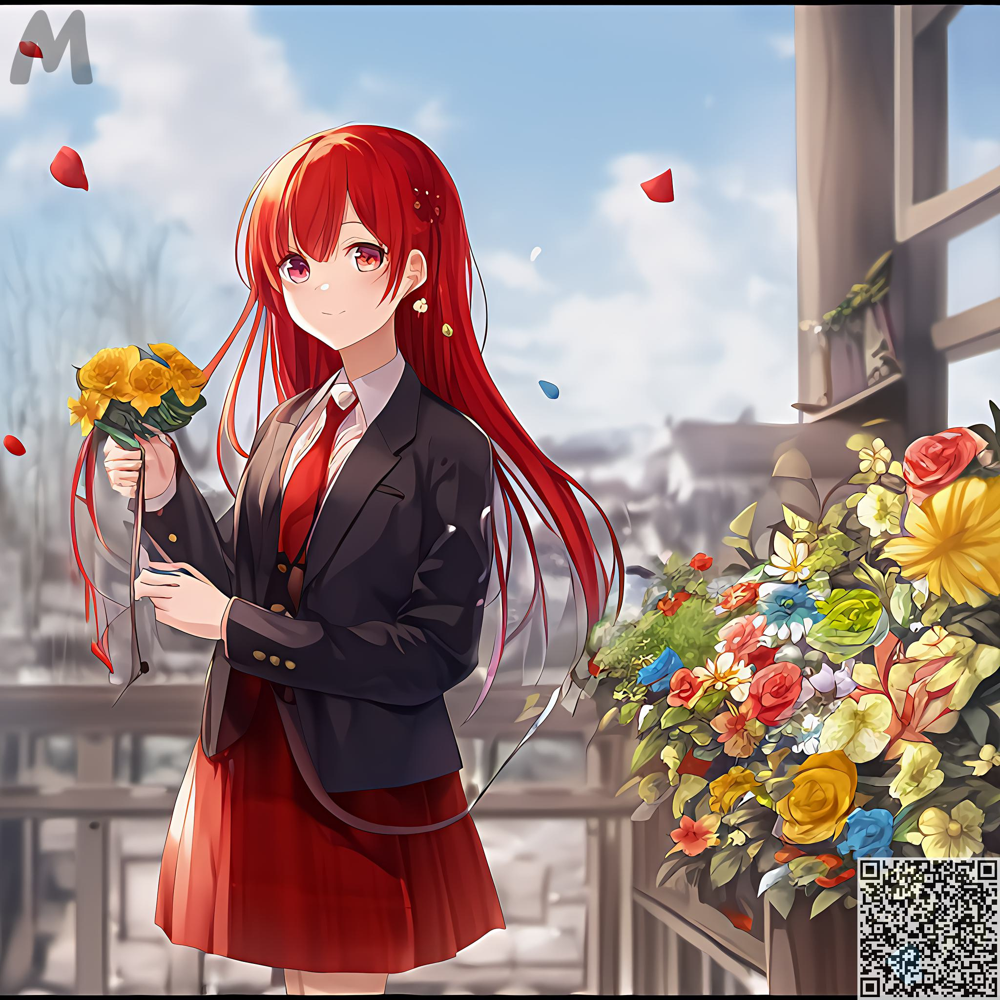
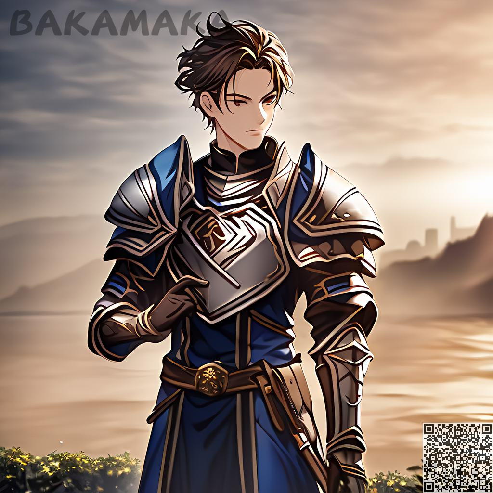
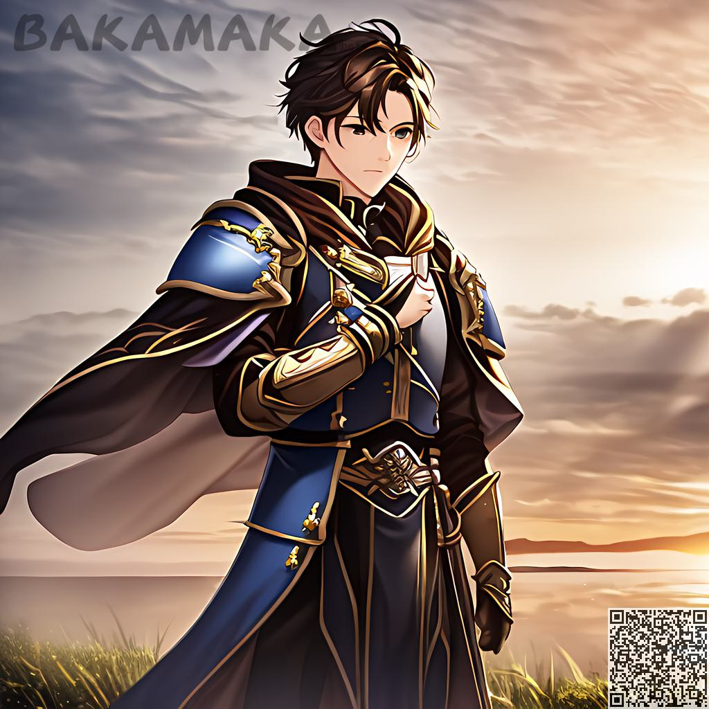
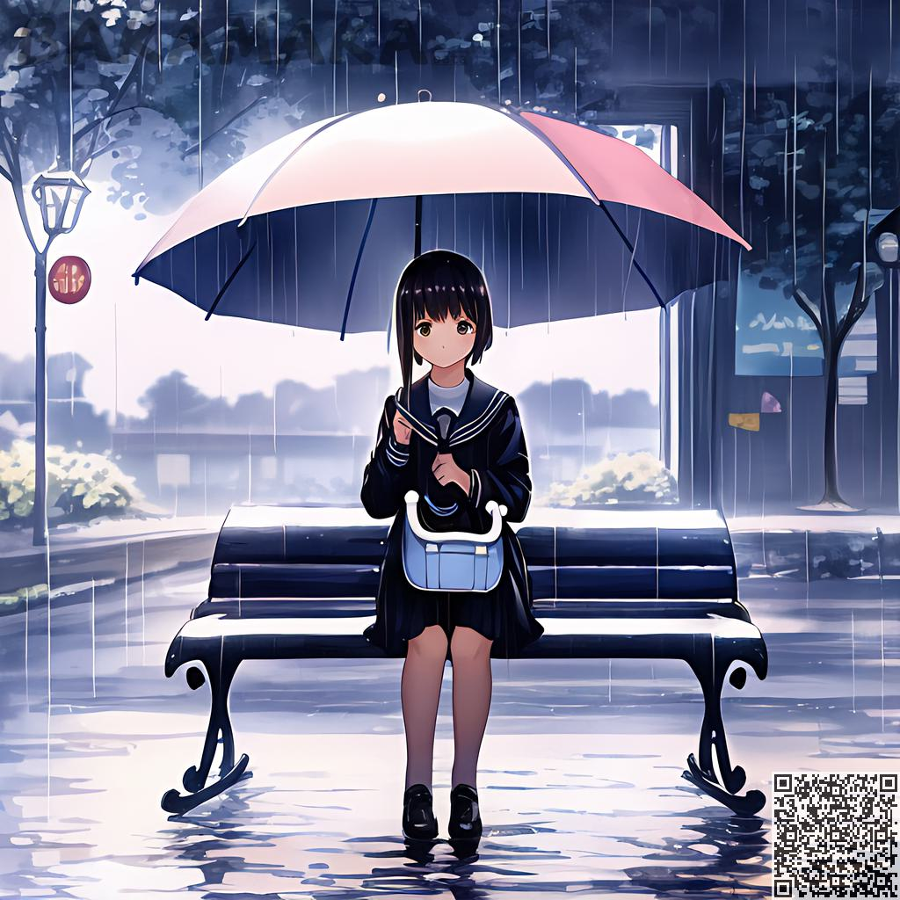

Instruction of Prompt
########################################

Basic Grammar：
:::::::::::::::::::::::::::::::::::::::::::::::::::::::::::::::::::::::::::::

The complete prompt consists of N tags, separated by commas, each tag belonging to a description of the current image.

The generation of a complete prompt for the base character includes：

  - ``【basic】`` ：Basics such as gender, hair and clothes

  - ``【dynamic】`` ：Orientation, body movement, expression

  - ``【object】`` ：Objects present on the scene, accessories present on the figure

  - ``【detail】`` ：Describe the level of detail in all of the above, e.g. the detail of the water, the delicate face, etc.

  - ``【special effects】`` ：Used to describe effects on scenes such as dynamic light, bloom, diffusion, velocity lines, etc.

A more detailed description will result in a generated image that is closer to the requirements.

.. code-block:: shell

    For example：one girl, happy, long hair, red hair, suit, flowers

.. image:: img/text2img_pic8.png
   :align: center
   :width: 300

Highlights Features of TAG：
:::::::::::::::::::::::::::::::::::::::::::::::::::::::::::::::::::::::::::::

You can make some of your tags stand out in the picture by emphasising them with some special syntax：

- ``{tag}`` : increase the weight of tag by a factor of  **1.05**
- ``(tag)`` : enlarges the weight of tag by a factor of  **1.1** 
- ``[tag]`` : decrease the weight of tag by **1.05** times

The superposition of multiple groups of stress symbols is represented as multiplication：

- ``{{tag}}`` : corresponding to a weight of **1.05*1.05**  times
- ``((tag))`` : **1.1*1.1** times the corresponding weight
- ``[tag]`` : corresponding weights reduced by **1.05*1.05** times

You can specify fixed weights in the form of **tag: weights**

- {tag: 1.5}, [tag: 1.5], (tag: 1.5)，all of which represent a direct setting of that tag's weight to 1.5 times; adding more {}, [], () would be invalid under this syntax.

Each group of tags needs to be highlighted separately，such as

.. code-block:: shell

    one girl, happy, long hair, red hair, {suit}, {flowers}

Error case:

.. code-block:: shell

    one girl, happy, long hair, red hair, {suit, flowers}

.. note::

    It is recommended that the weighting does not exceed 1.5, otherwise it will affect the overall look and feel of the image.

Let's see the results:

.. code-block:: shell

    one girl, happy, long hair, red hair, suit, {flowers：1.5}

Have a try
:::::::::::::::::::::::::::::::::::::::::::::::::::::::::::::::::::::::::::::

Basic
:::::::::::::::::::::::::::::::::::::::::::::::::::::::::::::::::::::::::::::

After getting familiar with the basic grammar operations, we have to start building our own exclusive AI creations.

For instance，if you want a warrior：
^^^^^^^^^^^^^^^^^^^^^^^^^^^^^^^^^^^^^
.. code-block:: shell

    one boy, armor

If you want a warrior with a cloak：
^^^^^^^^^^^^^^^^^^^^^^^^^^^^^^^^^^^^^
.. code-block:: shell

    one boy, armor, cloak

If you want a warrior with a cape, a crown and wings：
^^^^^^^^^^^^^^^^^^^^^^^^^^^^^^^^^^^^^^^^^^^^^^^^^^^^^^^

.. code-block:: shell

    one boy, armor, cloak, feathered wings, crown

.. image:: img/text2img_pic13.png
   :align: center
   :width: 300

.. note::

    If you find the weighting adjustment troublesome or unfamiliar, please try the automatic weighting option we provide.
    [When automatic weighting is turned on, manually adjusted emphasis will not be valid, so please use caution!]

If you do not want a background, then you can do this：
^^^^^^^^^^^^^^^^^^^^^^^^^^^^^^^^^^^^^^^^^^^^^^^^^^^^^^^^^

.. code-block:: shell

    one girl,armor,official art,simple background, fire

.. image:: img/text2img_pic14.png
   :align: center
   :width: 300

Want your anime scene? Then all you need to do is enter it like this：
^^^^^^^^^^^^^^^^^^^^^^^^^^^^^^^^^^^^^^^^^^^^^^^^^^^^^^^^^^^^^^^^^^^^^^^^

.. code-block:: shell

    a small 1girl holding an {umbrella} sitting alone on a {bench} after school. {{{masterpiece}}}, high quality, beautifully painted, pixiv, artstation hq, production art, comfort, [rain], reflective, dynamic light, cute, spring, 8k, {detailed face}, beautiful face, {bus stop}

.. code-block:: shell

    high quality background detailed sky {rainforest} anime fantasy hd magical rain woods view from ground dirt moss masterpiece {{hyper realistic}} night stars moon pond river small fireflies best quality clear resolution

.. image:: img/text2img_pic16.png
   :align: center
   :width: 300
   

With cloak and crown, with wings refinement of the warrior base
:::::::::::::::::::::::::::::::::::::::::::::::::::::::::::::::::::::::::::::

Firstly, we add [Dynamic], where the character looks into the camera, the character smiles and raises one hand

.. code-block:: shell

    one boy, armor, cloak, {feathered wings:1.3}, crown,Look at the camera, the characters smile and raise one hand

.. image:: img/cb_1.jpg
   :align: center
   :width: 300

Then add [Object], Castle, Badge on chest

.. code-block:: shell

    one boy, armor, cloak, {feathered wings:1.4}, crown,Look at the camera, the characters smile and raise one hand,Castle, {badge on chest:1.3}

.. image:: img/cb_2.jpg
   :align: center
   :width: 300

Add [Detail] [Effects] again, delicate face, flame glow, diffusion, bubbles, floating feathers

.. code-block:: shell

    one boy, armor, cloak, {feathered wings:1.4}, crown,Look at the camera, the characters smile and raise one hand,Castle, {badge on chest:1.3},Exquisite face, flame glow, diffusion, foam, floating feathers

.. image:: img/cb_3.jpg
   :align: center
   :width: 300

.. note::

    You can randomize the pictures with multiple times. If you can’t get satisfied pictures by random, please check whether the keyword description is accurate.