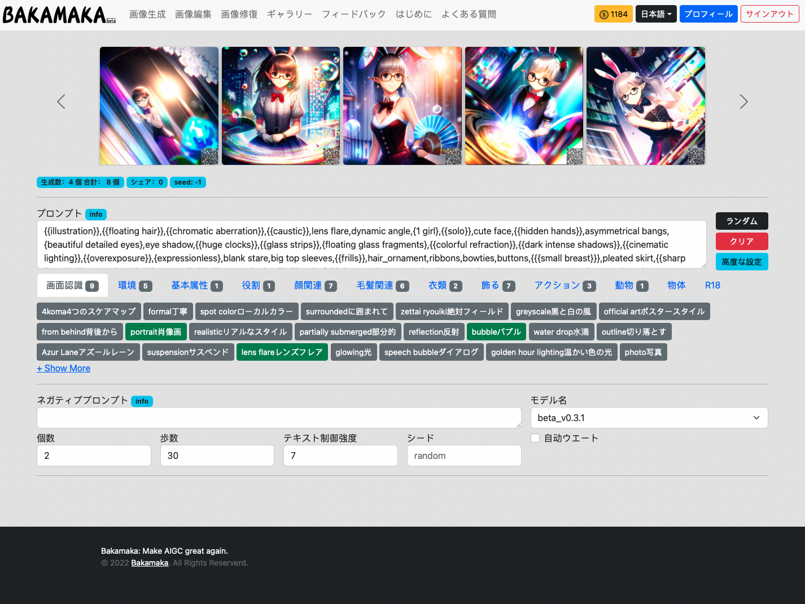

Txt2imgインターフェイスの紹介
########################################

1.インターフェースの概要​
----------------------------------------

ナビゲーション領域
=======================================

   - Txt2img：語彙の記述による画像生成

   - Img2img：あらかじめ定義された画像と説明語彙をアップロードして画像を生成する

   - inpaint：選択した領域を説明語で選択して画像を生成する

個人情報 ​
=======================================

   - 残っているひらめきポイント ​

   - 使用言語​

   - マイプロフィール: 世代別の履歴を見る​

   - ログアウト​

1.1 プレビュー​
----------------------------------------

   - 生成された画像はここに表示されます。​
   
   - 最初にページを開いたときは、あらかじめ用意された画像の一部がここに表示されます。​

1.2 説明​
----------------------------------------

   - ここでは、必要な説明文を編集して入力することができます（`ガイド <Prompt_course.html>`_）

1.3 ショートカット​
----------------------------------------

   - ランダムです：公式に良いとされる「説明文」の一部が、説明文の欄にランダムに追加されます。
   - 空にする：このボタンをクリックすると、説明領域内のすべてのディスクリプタが空になります。​
   - 詳細：このボタンをクリックすると、「逆引き説明文エリア」「モデル選択エリア」「パラメータ選択エリア」「画像パラメータエリア」の表示/非表示が切り替わります。​

1.4  プリセットタグリスト​
----------------------------------------

 -  ここでは、ユーザーが選択できるように、いくつかのプリセットタグをあらかじめ設定しておきます。​

1.5 逆引き説明文 ​
----------------------------------------

   - ここでは、必要なディスクリプタを編集して入力することができます（`ガイド <Prompt_course.html>`_）

   - この機能は主にAIがランダムに再生され、様々なランダムコンテンツが持ち込まれる可能性がありますが、それを絵に表示させたくない場合に使用します​

1.6 モデルの選択​
----------------------------------------

   - ここでは、様々なスタイルのモデルを選択することができます（現在は1つのモデルのみ利用可能です）​

1.7 パラメータの選択 ​
----------------------------------------
   - 生成される画像の数：1回のセッションで生成される画像の数​
   - 生成するステップ数：一回の計算のステップ数、30-100を推奨、値が大きくなるほど生成される画像は細かくなり、時間も長くなります​
   - テキスト制御強度：説明テキストが生成される画像に対してどの程度の制御を行うかを定義するために使用されます。一般的に7程度​
   - シード：固定すると、同じパラメータで毎回同じ画像を生成します。​
   - 自動重み付け: 選択すると、生成プロセスで説明文の一部の単語に自動的に重みを付けて、生成効果を大幅に向上させることができます。​

1.8 画像パラメータ​
----------------------------------------

   - 画像のアスペクト比選択：ユーザーは3つのアスペクト比から選択できます：2：3、1：1、3：2​
   - 画像アスペクトの選択：異なるオプションは、結果画像のアスペクト解像度を表します。Mは768、Lは1536、3Kは3072、6Kは6144で、解像度が高ければ高いほど、生成される画像の価格が高くなります〜。​~
   - ジェネレートボタンです：生成します。その横の小さな数字は、この画像を生成するのに必要なポイント数を表しています。​

