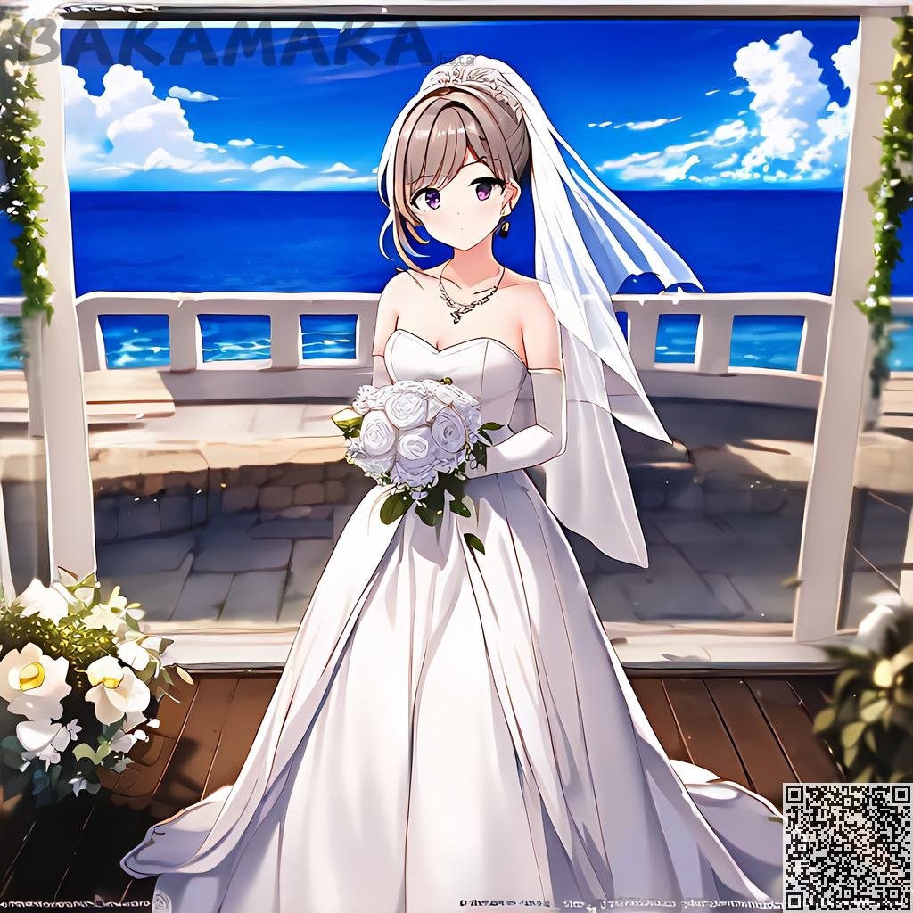

Img2imgのインターフェース紹介
########################################

1.インターフェース概要
----------------------------------------
.. image:: img/i2i_1.png
   :align: center

** ナビゲーションエリア
=======================================

   - Text to image：語彙を記述して画像を生成する

   - Image to Image：あらかじめ用意された画像を説明語とともにアップロードすることで画像を生成する

   - Inpaint：領域を選択し、説明語を記述して画像を生成する。

** 個人情報 
=======================================

   - 残りのインスピレーションポイント 

   - 使用言語

   - マイプロフィール：世代別の履歴を見る

   - ログアウト

1.1 プレビュー
----------------------------------------

プレビューエリアでは、アップロードした画像と生成された画像のサムネイルをプレビューすることができます

- 左側には、アップロードした画像が表示されます。デフォルトでは、使用するためのデモを提供します。

- 右側には、説明の語彙を使用して生成された最終的な画像と、元の画像が表示されます。

- 右下には、複数の画像を切り替えて表示することができます。

1.2 説明文
----------------------------------------

   - ここで好きな説明文を編集して入力することができます（`ガイド <Prompt_course.html>`_）

1.3 ショートカット
----------------------------------------

   - 空にする：このボタンをクリックすると、"説明領域 "のすべてのディスクリプタが空になります。
   - 詳細設定：このボタンをクリックすると、"逆引き記述領域"、"モデル選択領域"、"パラメータ選択領域"、"画像パラメータ領域 "の表示/非表示が切り替わります。

1.4 プリセットタグリスト
----------------------------------------

 - ここでは、ユーザーが選択できるように、いくつかのプリセットタグをあらかじめ設定しておきます。

1.5 高度な機能
----------------------------------------

- リバース説明

   - ここでは、希望するディスクリプタを編集・入力することができます（`ディスクリプター関連チュートリアル <Prompt_course.html>`_）

   - ここの機能は主にAIがランダムに再生されるときに使われ、様々なランダムコンテンツを持ってくることがあるので、絵に表示させたくないものはここに入力することができますの機能は主にAIがランダムに再生されるときに使われます。様々なランダムコンテンツを持ってくることがありますが、それを絵に表示させたくない場合は、ここに表示させたくないものを入力することができます。

- モデル選択エリア​

    - ここでは様々なスタイルのモデルを選択することができます（現在は1つのモデルのみ利用可能です）​

- ジェネレート量​

    - 1回のセッションで生成できる量が多ければ多いほど、消費する時間と``インスピレーション・ポイント''も多くなる

- ステップを生成する

    - 单次计算步数，建议30-100，数值越大生成的图片将越精细，同样所消耗的时间也会更加多

- テキスト制御強度

    - 説明テキストが生成される画像に対してどの程度の制御を行うかを定義するために使用します。 通常7前後。

- 種子

    - 同じパラメータで、生成されるグラフが毎回同じになるように修正しました

- 自動重み付け

    - 選択すると、説明文中の一部の単語に生成時に自動的に重み付けを行い、結果を大幅に向上させることができる

- strength

    - 元画像に対する修正の強さを定義し、値が大きいほど強度が高くなる

1.6 Upload and generate​
----------------------------------------

- Upload

    - この機能を使用して、画像をサーバーにアップロードし、プレビュー エリアに表示できます。​

- 生成

    - 生成. その横の小さな数字は、この生成に必要なポイントの数を表します. ポイントの数は、

    - 生成された画像の数と生成された画像の解像度に比例します

1.7 Do it yourself！​

----------------------------------------

デモのこの画像で試してみましょう​

注：I2Iの非常に重要なパラメータは強度です。​

- lens flare

注：I2Iの非常に重要なパラメータは強度です。​

 現在 0.9 

.. image:: img/i2i_5.png
   :align: center
   :width: 300

試してみよう​ 

.. image:: img/i2i_4.jpg
   :align: center
   :width: 300

まあ、無理している感は否めませんが。​レンズフレア以外は、ちょっと元画像と違いますね。​大丈夫です、強さのパラメータを0.6に変更します。​

先ほどの話を覚えていますか？強さの値が高いほど、より大きな ​

.. image:: img/i2i_6.png
   :align: center
   :width: 300

続けて、次のような生成に挑戦してみましょう。

.. image:: img/i2i_3.jpg
   :align: center
   :width: 300

OK、完了です！元画像にエフェクトを追加しました。​
