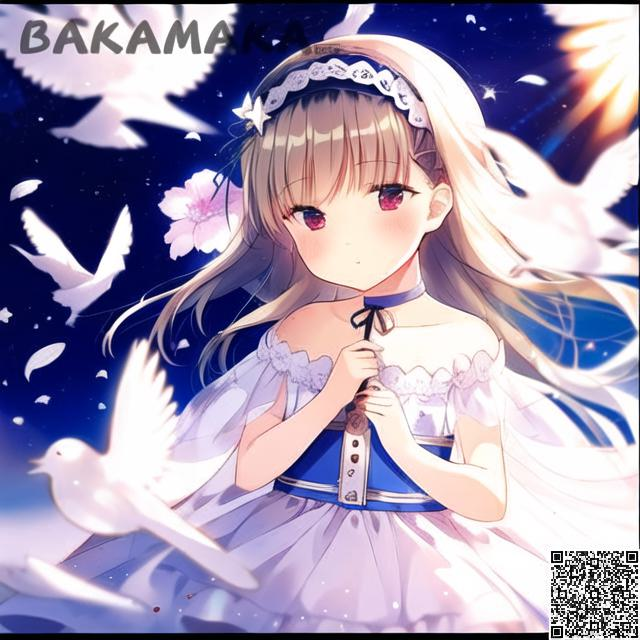

Inpaintのインターフェース紹介​
########################################

1.インターフェイスの概要​
----------------------------------------
.. image:: img/inpaint_1.png
   :align: center

.. note::

     inpaintとImg2imgの違いは編集可能な操作のみで、この導入は他の機能では導入されません。​

1.1 操作領域​
----------------------------------------

この機能により、ユーザーはこの領域で直接マウスをクリックし、スワイプすることで領域を変更することができます。​

.. image:: img/inpaint_tu_tu2.png
   :align: center
   :width: 300

.. image:: img/inpaint_tu_tu4.png
   :align: center  
   :width: 300

写真のように、元画像に手を加えて、その部分を黒く塗ることができます。​
​

この機能は ``impaint area`` のみを変更します。

1.2 Line Width
----------------------------------------

- ブラシサイズ、マニピュレーション可能な領域を操作する際に、1パスで変更できる大きさ。​

1.3  Do it yourself!​
----------------------------------------

- デモ画像では、キャラクターの目が青くなっていますが、これを赤に変えてみます。​
  
.. image:: img/inpaint_tu_tu2.png
   :align: center  
   :width: 300

- ペイントブラシ」機能を使って、画像上の目を黒くし、魔法で変身させました

.. image:: img/inpaint_tu_tu1.png
   :align: center  
   :width: 300

再びキーワード「赤い目」を追加します。

- Red eyes

OK、では早速、下の生成するをクリックしてみましょう。

.. note::

    画像の描画領域が小さすぎる場合、動作しないことがあります

OK、完了です！元画像の上に目を赤に修正しました。
