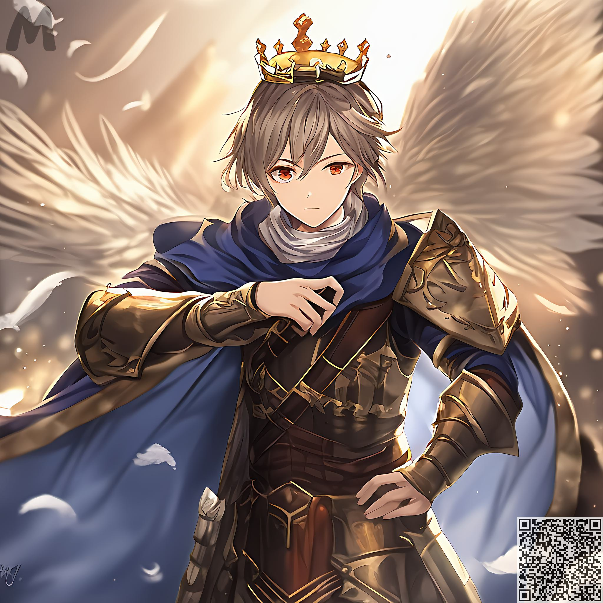
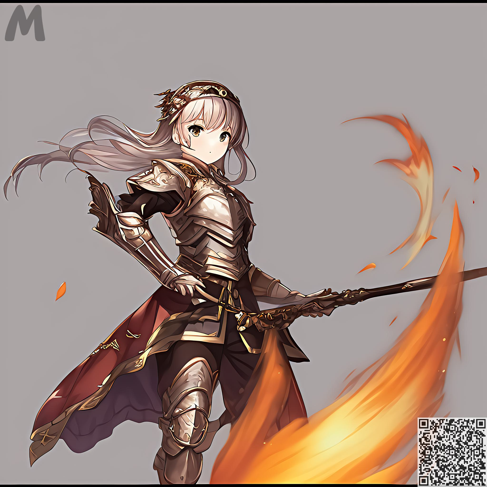
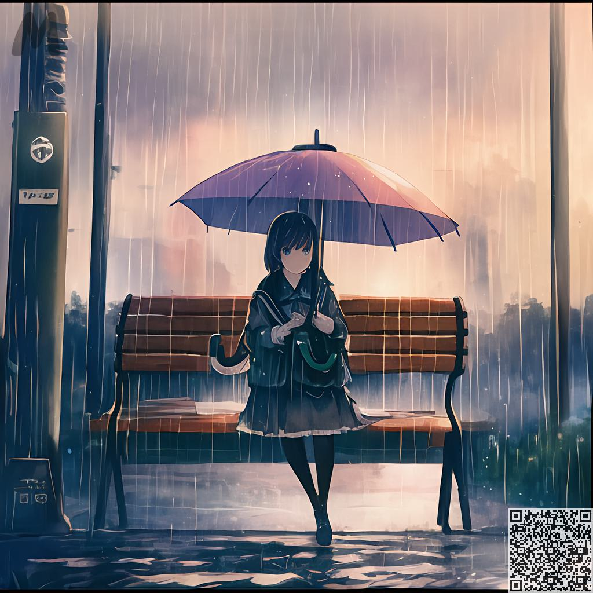
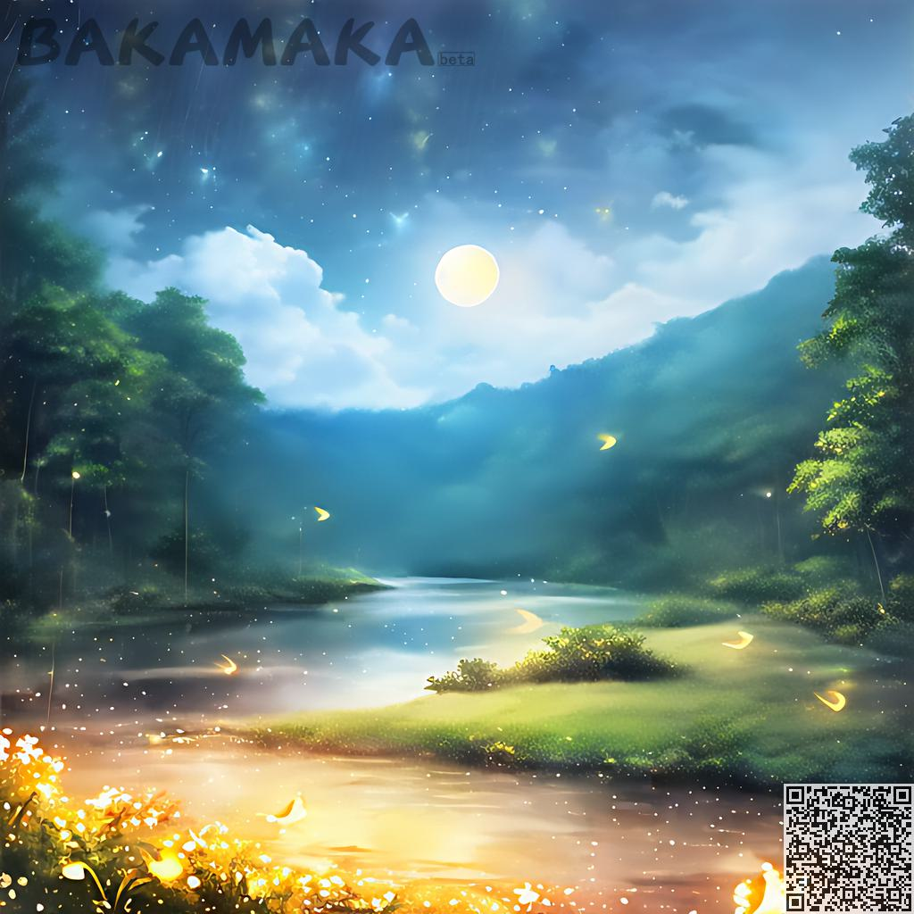
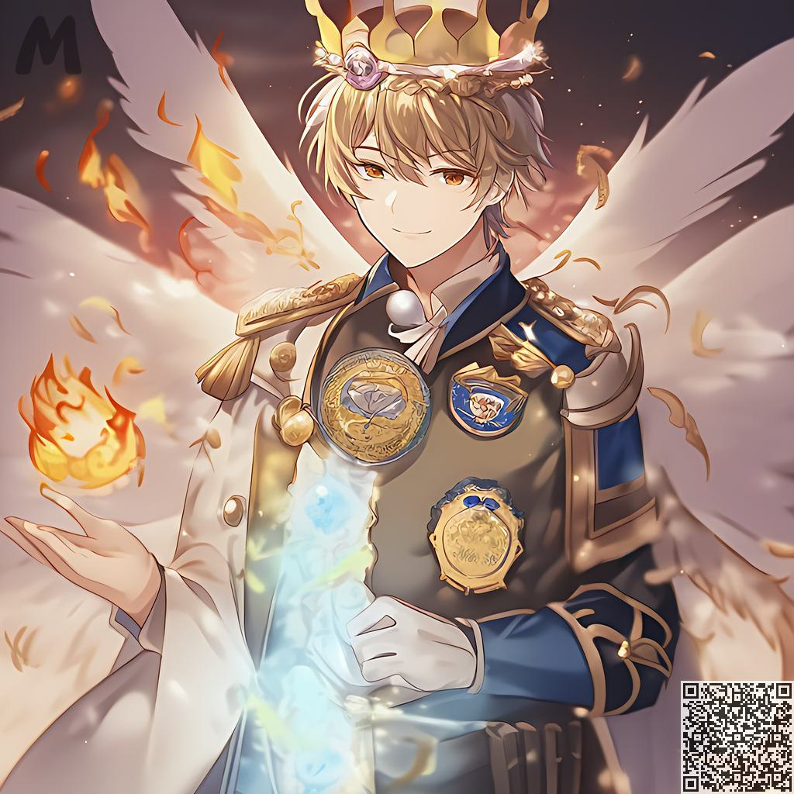

Promptの説明​
########################################

基本文法​：
:::::::::::::::::::::::::::::::::::::::::::::::::::::::::::::::::::::::::::::

完全なプロンプトは、カンマで区切られたN個のタグからなり、各タグは現在の画像の説明に属する。​

 ベースとなるキャラクターに対する完全なプロンプトの生成は以下の通りです。​

  - ``【basic】`` 性別、髪型、服装などの基本的なもの​

  - ``【dynamic】`` ：向き、体の動き、表情など​

  - ``【object】`` シーンにあるオブジェクト、フィギュアにあるアクセサリー​

  - ``【detail】`` ：水面の細かさ、繊細な顔立ちなど、上記すべてのディテールを表現してください。​

  - ``【special effects】`` ：ダイナミックライト、ブルーム、ディフューズ、ベロシティラインなど、シーンに与える効果を表現するために使用します。​

より詳細に記述することで、より要件に近い画像が生成されます。​

.. code-block:: shell

   one girl, happy, long hair, red hair, suit, flowers

.. image:: img/text2img_pic8.png
   :align: center
   :width: 300

TAG のハイライト機能 ​
:::::::::::::::::::::::::::::::::::::::::::::::::::::::::::::::::::::::::::::

タグの一部を特殊な構文で強調することで、画像の中で目立たせることができます：

- ``{tag}`` :  タグの重さを ``1.05`` にする。
- ``(tag)`` : タグの重みを ``1.1`` 倍で拡大します。​
- ``[tag]`` : タグを ``1.05`` 倍重くする。

複数のストレスシンボル群の重ね合わせは，乗算で表現される：​

- ``{{tag}}`` :  ``1.05*1.05`` 倍の重量に相当する。
- ``((tag))`` : 対応する重量の ``1.1*1.1`` 
- ``[tag]`` : 対応する重みが ``1.05*1.05`` になります。​

weightsの形式で固定ウェイトを指定することができます。​

- {tag: 1.5}, [tag: 1.5], (tag: 1.5) これらはすべて、そのタグの重みを1.5倍に直接設定することを表します。さらに {}, [], () を追加しても、この構文では無効となります。​

タグの各グループは別々にハイライトする必要があります：​

.. code-block:: shell

    one girl, happy, long hair, red hair, {suit}, {flowers}

Error case：​

.. code-block:: shell

    one girl, happy, long hair, red hair, {suit, flowers}

.. note::

   重み付けが1.5を超えると、画像全体の見た目に影響が出るので、1.5を超えないようにすることをお勧めします。

それでは、結果を見てみましょう：​

.. code-block:: shell

    one girl, happy, long hair, red hair, suit, {flowers：1.5}

.. image:: img/text2img_pic9.png
   :align: center
   :width: 300

Have a try！​

:::::::::::::::::::::::::::::::::::::::::::::::::::::::::::::::::::::::::::::

基本​
:::::::::::::::::::::::::::::::::::::::::::::::::::::::::::::::::::::::::::::

基本的な文法操作に慣れたら、次は自分たちだけのAI作品を作っていかなければなりません。​

たとえば、戦士が欲しい場合：​
^^^^^^^^^^^^^^^^^^^^^^^^^^^^^^^^^^^^^
.. code-block:: shell

    one boy, armor

.. image:: img/text2img_pic10.png
   :align: center
   :width: 300

マント、マントえた戦士が必要な場合：​
^^^^^^^^^^^^^^^^^^^^^^^^^^^^^^^^^^^^^
.. code-block:: shell

    one boy, armor, cloak

.. image:: img/text2img_pic11.png
   :align: center
   :width: 300

マント、王冠、翼を備えた戦士が必要な場合：​
^^^^^^^^^^^^^^^^^^^^^^^^^^^^^^^^^^^^^^^^^^^^

.. code-block:: shell

    one boy, armor, cloak, feathered wings, crown

.. note::

  ウェイトの調整が面倒または慣れていない場合は、自動ウェイト オプションをお試しください
     【自動ウエイトをオンにすると、手動で調整したエンハンスが無効になりますのでご注意ください！ ]

背景が必要ない場合は、次のようにします。
^^^^^^^^^^^^^^^^^^^^^^^^^^^^^^^^^^^^^^^^^^^^

.. code-block:: shell

    one girl,armor,official art,simple background, fire

二次元のアニメシーンが欲しいですか？ 次に、次のように入力するだけです。
^^^^^^^^^^^^^^^^^^^^^^^^^^^^^^^^^^^^^^^^^^^^^^^^^^^^^^^^^^^^^^^^^^^^^^^^^^^^^^^

.. code-block:: shell

    a small 1girl holding an {umbrella} sitting alone on a {bench} after school. {{{masterpiece}}}, high quality, beautifully painted, pixiv, artstation hq, production art, comfort, [rain], reflective, dynamic light, cute, spring, 8k, {detailed face}, beautiful face, {bus stop}

.. code-block:: shell

    high quality background detailed sky {rainforest} anime fantasy hd magical rain woods view from ground dirt moss masterpiece {{hyper realistic}} night stars moon pond river small fireflies best quality clear resolution

   

外套と王冠があり、翼を持つ戦士は洗練されたデザインに基づいています。
:::::::::::::::::::::::::::::::::::::::::::::::::::::::::::::::::::::::::::::

まず、[dynamic] を追加し、キャラクターがカメラを見て、キャラクターが微笑んで、片手を上げる

.. code-block:: shell

    one boy, armor, cloak, {feathered wings:1.3}, crown,Look at the camera, the characters smile and raise one hand

.. image:: img/cb_1.jpg
   :align: center
   :width: 300

次に、[object]、城、胸のバッジを追加します

.. code-block:: shell

    one boy, armor, cloak, {feathered wings:1.4}, crown,Look at the camera, the characters smile and raise one hand,Castle, {badge on chest:1.3}

.. image:: img/cb_2.jpg
   :align: center
   :width: 300

[detail][特殊効果]を再度追加、絶妙な顔、炎光輪、拡散、泡、浮遊羽

.. code-block:: shell

    one boy, armor, cloak, {feathered wings:1.4}, crown,Look at the camera, the characters smile and raise one hand,Castle, {badge on chest:1.3},Exquisite face, flame glow, diffusion, foam, floating feathers

.. note::

    納得のいく数の画像をランダム化できます. それでもランダムな画像が得られない場合は、キーワードの説明が正しいかどうかを確認してください.
