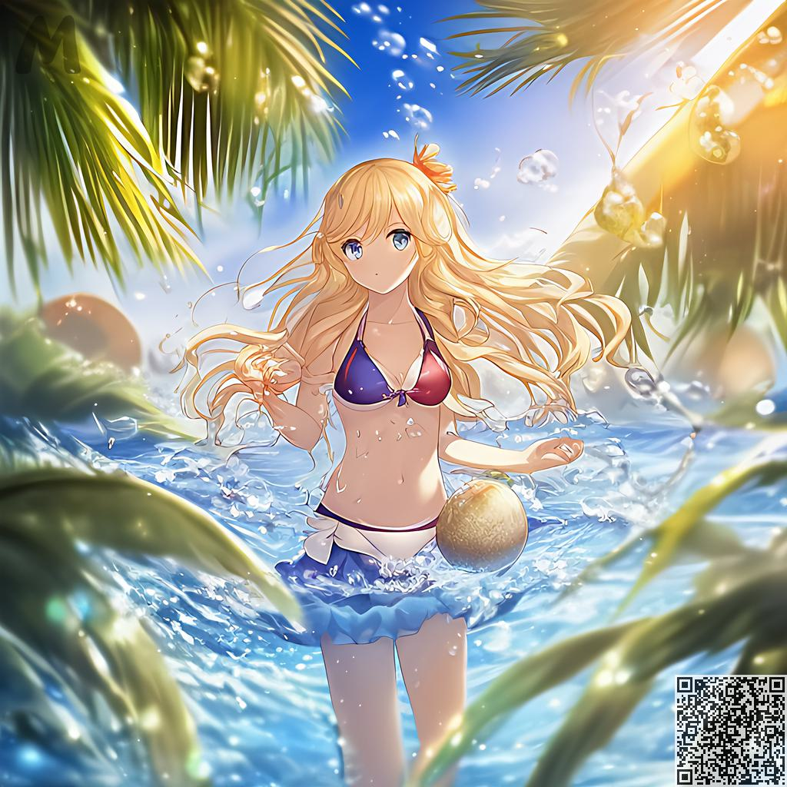

キャラクターやシーンの具体的な作り方
########################################

.. note::
   
   このチュートリアルでは、効果的に地図を作成できる方法論を説明しますが、この方法でしか地図を作成できないという意味ではありません。

1.一般的な構造を構築する
=====================================

まず頭の中に大まかなシーンと人物（下図の中で表現されている感覚など）を構築します

.. image:: img/text2img_pic28.png
   :align: center
   :width: 300

この時点で、頭の中で簡単な説明語彙を想像できるはずです

- 女の子、青い髪、青い瞳、ビキニ水着

.. code-block:: shell

    A girl, blue hair, blue pupils, bikini

比較的単純なので、生成してみましょう

.. image:: img/cgc_1.jpg
   :align: center
   :width: 300

現時点ではまだ非常に粗雑ですが、問題ではありません。他の変更された語彙を追加し続けます

2.詳細な説明を追加
=====================================

基本的に構造全体を正常に構築できたので、あとは他の修飾子を追加するだけです。

私たちはいくつかのステップを踏みます

   1.联想到海边存在什么？海水，椰树，海滩，阳光，飞溅，气泡，海浪

   2.ダイナミックライト、浮遊髪、宝石の目、拡散、サラウンドなどの形容詞をベースに追加します

   3.この被写体にダイナミックを追加した後、カメラに向かって

ついに手に入れた

- カメラに向かって、美しい詳細な海水、泡、椰子の木、ビーチ、ダイナミックな光、浮かぶ髪、太陽、水しぶき、波、宝石の目、拡散、サラウンド

.. code-block:: shell

    Facing the camera, beautiful sea water with details, bubbles, coconuts, beaches, dynamic light, floating hair, sunlight, splash, waves, jewel like eyes, diffusion, surround

.. note::

   ユーザーが選択できるようにマニュアルにいくつかの形容詞を追加します。ユーザーは、提供されているプリセットの説明を使用して変更することもできます (作成中)。

説明的な語彙を追加するときは、想像したシーンに何が必要かを想像するために最善を尽くす必要があります

.. image:: img/cgc_2.jpg
   :align: center
   :width: 300

上記のように結果を再度生成します

この時点で、生成された画像がほとんどの条件を満たしていることがわかります。

3.詳細説明を修正
=====================================

たとえば、長い黄色の髪にしたい場合、記述子 「blue hair」を「 Long yellow hair」に変更できます。

.. code-block:: shell

   A girl, Long yellow hair, blue pupils, bikini,Facing the camera, beautiful sea water with details, bubbles, coconuts, beaches, dynamic light, floating hair, sunlight, splash, waves, jewel like eyes, diffusion, surround

何もなければ、長い髪の女の子の写真が撮れます

同様に、他のコンテンツを生成したい場合は、それを追加または変更することもできます

4.概要
=======================================================

生成の過程で、一晩でできるとは思わないでください。いくつかの点に従ってください：

- キャラクターの一般的なスタイル（性別、髪、服装などの基本的な内容）の説明を優先してください。

- 向きや体の動きなど、キャラクターのダイナミクスを説明する
  
- シーンに存在するオブジェクトについて説明します (海水、ココナッツ、貝殻、家など)。

- 詳細な水、本物の水、浮き毛など、オブジェクトの詳細レベルを記述します。

- 記述子を追加または削除するには、2 ～ 4 を繰り返します。

- 満足の写真を得る
