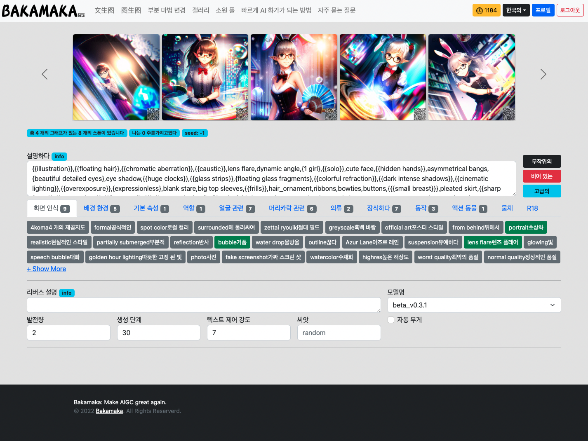

텍스트로 이미지를 생성하는 인터페이스 소개:
###################################################

1.인터페이스 소개
----------------------------------------

사이트 메뉴
=======================================

   - 텍스트로 이미지를 생성: 이미지를 설명하는 단어에 의해 생성됩니다.

   - 이미지로 이미지를 생성：사전 설정된 이미지와 설명 단어를 업로드하여 이미지를 생성합니

   - 부분 수정: 일부 구역 및 설명 단어를 선택하여 이미지 생성합니다

개인 데이터 구역
=======================================

   - 현재 남은 영감점 수

   - 언어 전환

   - 마이데이터: 히스토리 생성 기록을 볼 수있습니다.

   - 로그아웃

1.1 미리보기 구역
----------------------------------------

   - 생성된 이미지가 여기에 표시됩니다.
   
   - 페이지가 처음 열리면 미리 정의된 이미지 중 일부가 여기에 표시됩니다.

1.2 묘사
----------------------------------------

   - 여기에서 설명하려는 단어를 편집하고 입력할 수 있습니다(가이드).

1.3 빠른 기능
----------------------------------------

   - 랜덤: 이 기능은 공식적으로 좋은 "설명어" 중 일부를 설명 섹션에 무작위로 추가합니다.
   - 지우기: 이 버튼를 클릭하면 설명 영역의 모든 설명자가 비어 있습니다.
   - 고급: 이 버튼을 클릭하면 "역방향 설명 영역", "모델 선택 영역", "파라미터 선택 영역", "영상 파라미터 영역"이 표시되거나 숨겨집니다.

1.4 미리 설정된 태그 마트
----------------------------------------

 - 여기서 사용자가 선택할 수 있도록 미리 설정된 태그 중 일부를 미리 설정합니다.

1.5 역설명
----------------------------------------

   - 원하는 설명어를 편집하고 입력할 수 있습니다.（`설명어에 대한 자습서 <Prompt_course.html>`_）

   - 이 기능은 인공지능이 무작위로 재생할 때 주로 사용되며, 그림에 나타나지 않으려면 다양한 무작위 콘텐츠를 가져올 수 있습니다.

1.6 모델 선택
----------------------------------------

   - 여기서 다양한 스타일의 모델 중에서 선택할 수 있습니다(현재는 하나의 모델만 사용 가능).

1.7 매개 변수 선택
----------------------------------------
   - 생성된 이미지 수: 단일 세션에서 생성된 이미지 수
   - 생성할 단계 수: 단일 계산의 단계 수 30-100이 권장되며, 값이 클수록 생성된 이미지가 선명해지고 시간이 더 많이 소모됩니다.
   - 텍스트 제어 강도: 설명 텍스트가 생성된 이미지를 얼마나 제어하는지 정의하는 데 사용됩니다. 일반적으로 7쯤정도
   - 시드: 고정된 경우 동일한 파라미터가 매번 동일한 이미지를 생성합니다.
   - 자동 가중치: 이 옵션을 선택하면 생성 프로세스 중에 설명의 일부 단어에 가중치를 자동으로 부여할 수 있으므로 생성 효과가 크게 향상됩니다.

1.8 이미지 매개 변수
----------------------------------------

   - 이미지 가로 세로 비율 선택: 사용자는 2:3, 1:1, 3:2의 세 가지 가로 세로 비율 중에서 선택할 수 있습니다.
   - 이미지 측면 선택: 다른 옵션은 결과 이미지의 가로 세로 해상도를 나타냅니다. M은 768, L은 1536, 3K는 3072, 6K는 6144, 해상도가 높을수록 생성된 이미지의 가격이 높아집니다~
   - 생성 버튼: 생성하다. 옆에 있는 작은 숫자는 이 이미지를 생성하는 데 필요한 포인트 수를 나타냅니다.

