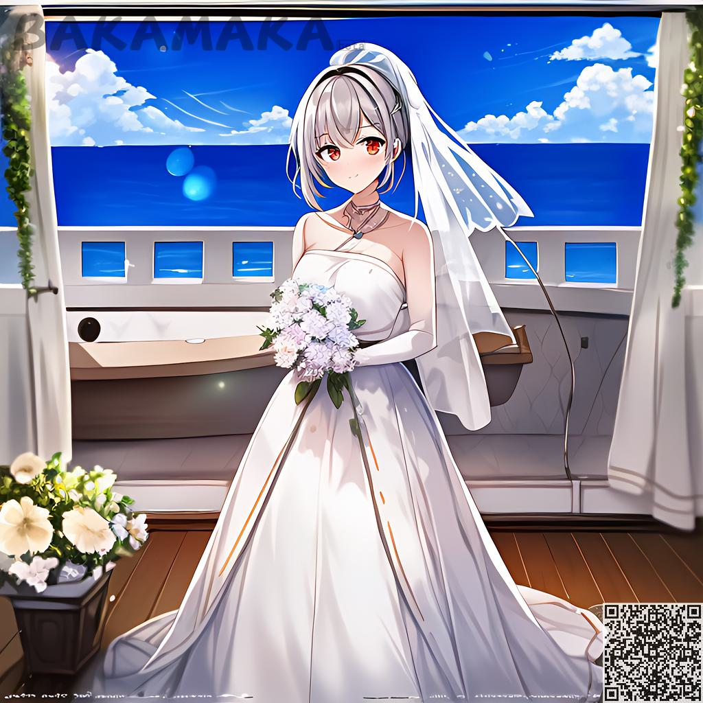

이미지로 이미지를 생성하는  인터페이스 소개:
####################################################3

1. 인터페이스 소개
----------------------------------------
.. image:: img/i2i_1.png
   :align: center

** 사이트의 메뉴
=======================================

   - 텍스트로 이미지를 생성：이미지를 설명하는 단어에 의해 생성됩니다

   - 이미지로 이미지를 생성：사전 설정된 이미지와 설명 단어를 업로드하여 이미지를 생성합니다

   - 부분 수정: 일부 구역 및 설명 단어를 선택하여 이미지 생성합니다

** 개인정보영역
=======================================

   - 현재 남은 영감 포인트 수 

   - 언어 스위치

   - 마이데이터: 히스토리 생성 기록을 볼 수 있습니다.

   - 로그아웃

1.1 미리보기 구역
----------------------------------------

  미리 보기 구역에서 업로드된 이미지와 결과 이미지 미리 보기를 사용할 수 있습니다.
  
  왼쪽에는 업로드한 이미지가 표시되며 기본적으로 사용할 수 있는 데모가 제공됩니다.
    
  오른쪽에는 설명어를 원본 이미지와 함께 사용하여 생성된 최종 이미지가 표시됩니다.
    
  오른쪽 아래에 있는 여러 이미지를 전환할 수 있습니다.

1.2 묘사
----------------------------------------

   - 여기서 원하는 설명어를 편집하고 입력할 수 있습니다(가이드).

1.3 빠른 기능
----------------------------------------

   - 지우기： 이 버튼를 클릭하면 "설명 영역"에 있는 모든 설명자가 비어 있습니다.
   - 고급: 이 버튼을 클릭하여 "역방향 설명 영역", "모델 선택 영역", "파라미터 선택 영역", "영상 파라미터 영역"을 표시하거나 숨깁니다.

1.4 미리 설정된 태그 마트
----------------------------------------

 - 여기서 사용자가 선택할 수 있도록 미리 설정된 태그 중 일부를 미리 설정합니다.

1.5 고급 기능
----------------------------------------

- 역설명

   - 여기서 원하는 설명어를 편집하고 입력할 수 있습니다(설명어에 대한 가이드).

   - 이 기능은 인공지능이 무작위로 재생할 때 주로 사용되며, 다양한 무작위 콘텐츠를 가져올 수 있으며, 그림에 나타나지 않으려면 여기에 표시하고 싶지 않은 내용을 입력하면 된다.

- 모델 선택 구역

    - 여기서 다양한 스타일의 모델을 선택할 수 있습니다(현재는 하나의 모델만 사용 가능).

- 수량생성

    - 생성할 수 있는 것이 많을수록 더 많은 시간과 영감이 필요합니다.

- 생성할 단계 수

    - 숫자가 높을수록 이미지가 더 세밀해지고 시간이 더 많이 걸립니다.

- 텍스트 제어 강도

    - 생성된 이미지에 대한 설명 텍스트의 제어 권한을 정의합니다. 보통 7

- 쯤정도

    - 고정, 매번 동일한 파라미터가 동일한 이미지를 생성합니다.

- 자동 가중치

    - 이 옵션을 선택하면 생성 프로세스 중에 설명에 있는 일부 단어에 자동으로 가중치를 부여할 수 있으므로 결과가 크게 향상됩니다.

- strength

    - Strength(강도)는 원본 영상에 대한 수정 강도를 정의합니다. 값이 높을수록 강도가 높습니다.

1.6 업로드 및 생성
----------------------------------------

- 업로드

    - 이 기능을 사용하여 이미지를 서버에 업로드하고 미리보기 영역에 표시할 수 있습니다
  
- 생성

    - 생성. 옆에 있는 작은 숫자는 이 생성에 필요한 포인트 수를 나타냅니다.

    - 포인트 수는 생성된 이미지 수와 생성된 이미지의 해상도에 비례합니다.

1.7 네가 직접 해 봐요
----------------------------------------

데모에 나온 이 이미지로 한번 해볼까요

.. image:: img/i2i_2.jpg
   :align: center
   :width: 300

우리는 작은 렌즈 후광를 추가하고 싶었다

- lens flare

 참고: I2I에서 매우 중요한 매개 변수는 strength입니다.

현재 0.9입니다.

.. image:: img/i2i_5.png
   :align: center
   :width: 300

한번 해보자

.. image:: img/i2i_4.jpg
   :align: center
   :width: 300

음, 너무 세게 밀어붙이는 것 같아요.
원본 이미지와 조금 다른 렌즈 플레어를 제외하고.
괜찮아요, 강도 파라미터를 0.6으로 변경합니다.
위에 언급된 것을 기억하세요? 강도 값이 높을수록 
더 많이 수정합니다.

.. image:: img/i2i_6.png
   :align: center
   :width: 300

다시 생성해 보겠습니다.

좋아요, 우리는 원본 이미지에 몇 가지 효과를 추가했어요.
