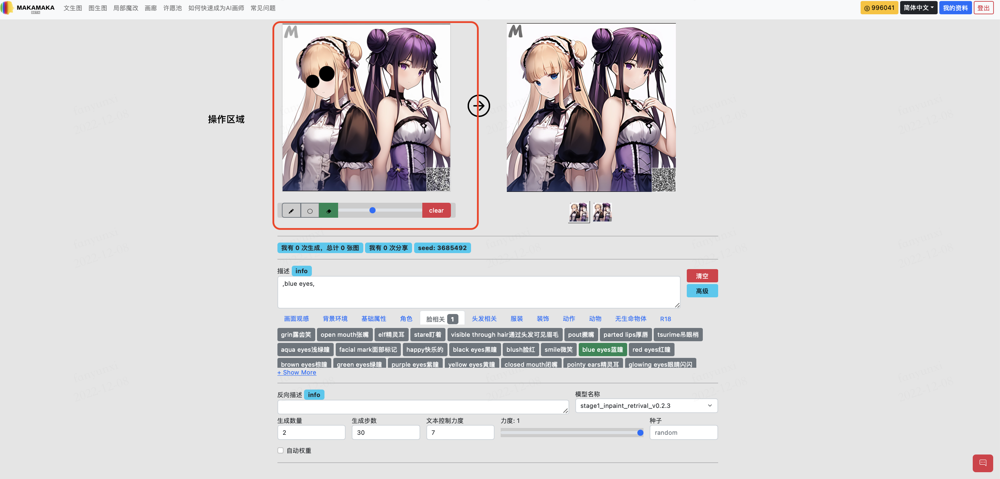
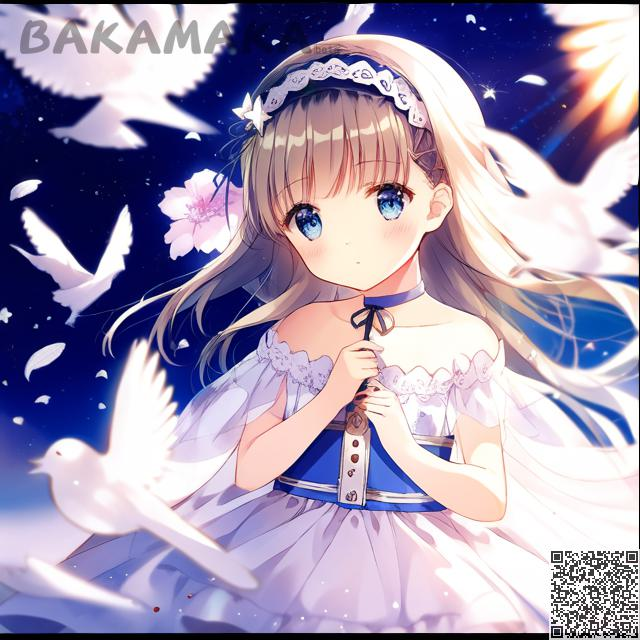

부분 수정하는 인터페이스 소개:
########################################

1.인터페이스 소개
----------------------------------------

.. note::

   【부분 수정】과【이미지로 이미지를 생성】의 유일한 차이점은 편집 가능한 작업에 있습니다. 이 소개는 다른 기능에는 적용되지 않습니다.

1.1 작업구역
----------------------------------------

이 기능을 통해 사용자는 이 구역에서 마우스를 직접 클릭하고 이동하여 이미지 부분을 수정할 수 있습니다.

.. image:: img/inpaint_tu_tu4.png
   :align: center  
   :width: 300

사진과 같이 원본 이미지를 작업할 수 있고 부분을 검은색으로 칠할 수 있습니다.

이 기능은 그림판 구역만 수정합니다.

1.2 선 폭
----------------------------------------

- 브러시 크기, 조작 가능한 구역을 조작할 때 단일 패스로 변경할 수 있는 영역의 크기입니다.
  
1.3 직접 해 봐요.
----------------------------------------

- 우리는 데모 이미지에서 캐릭터의 눈이 파란색이고 빨간색으로 바뀌는 것을 볼 수 있다.
  

- 우리는 그녀의 눈에 페인트칠을 하기 위해 검은색 브러시 기능을 사용할 수 있습니다.

.. image:: img/inpaint_tu_tu1.png
   :align: center  
   :width: 300

그런 다음 "붉은 눈"이라는 키워드를 추가합니다. 이제 생성 버튼을 클릭합니다.

- Red eyes

다시 생성해 보겠습니다.

.. image:: img/inpaint_tu_tu3.png
   :align: center  
   :width: 300

.. note::

    참고: 블러시 영역이 너무 작으면 생성할 수 없는 문제가 발생합니다.

보시다시피, 우리는 성공적으로 눈을 빨간색으로 바꾸었습니다.
