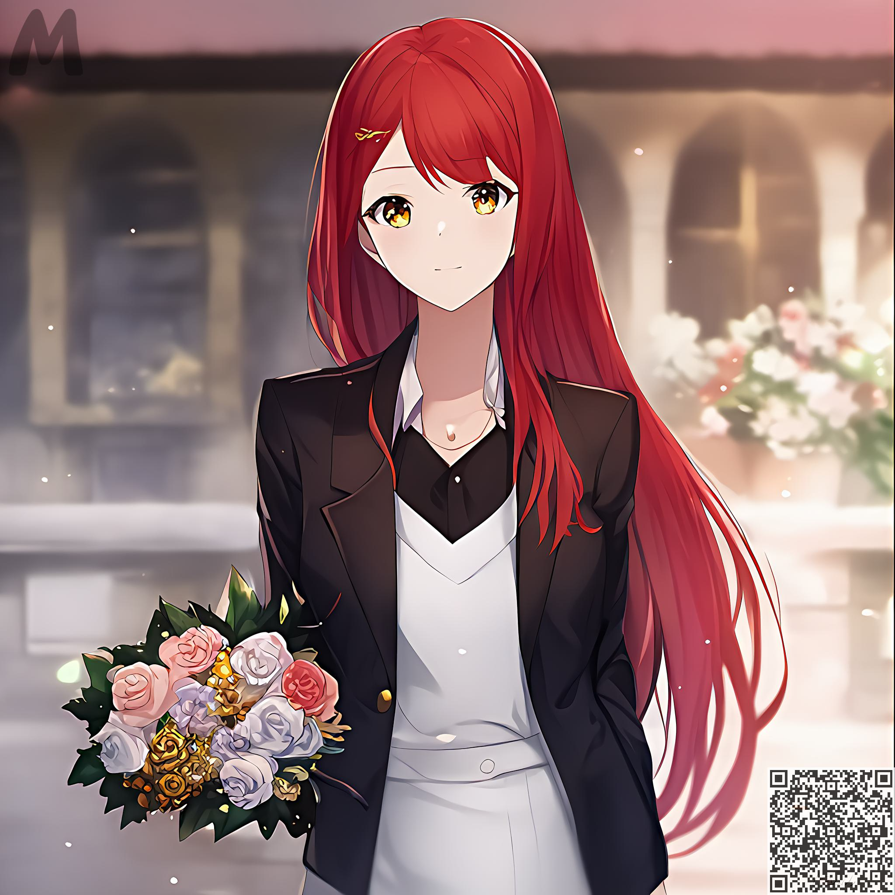
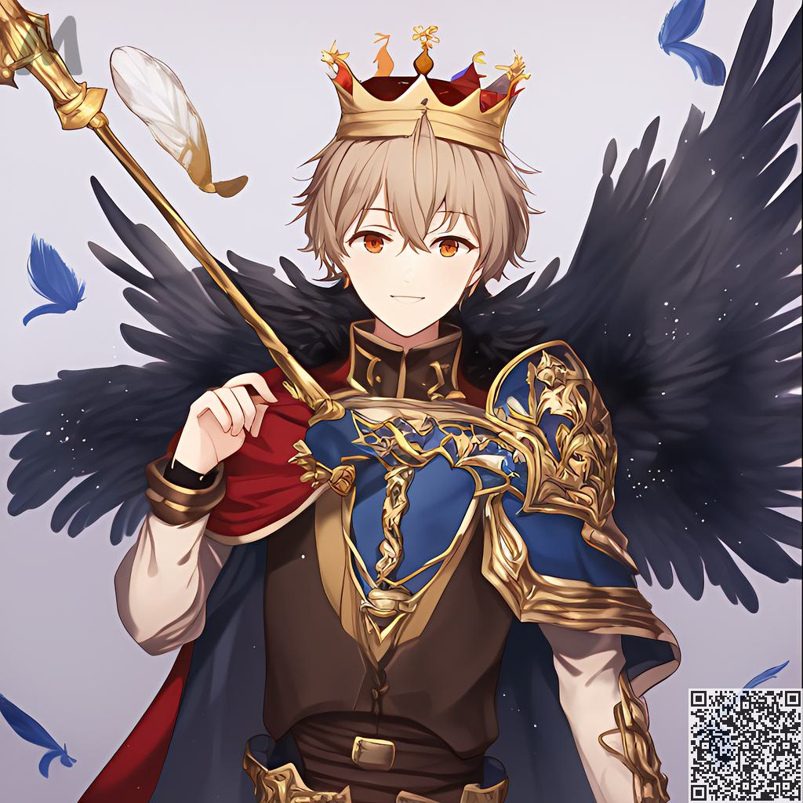
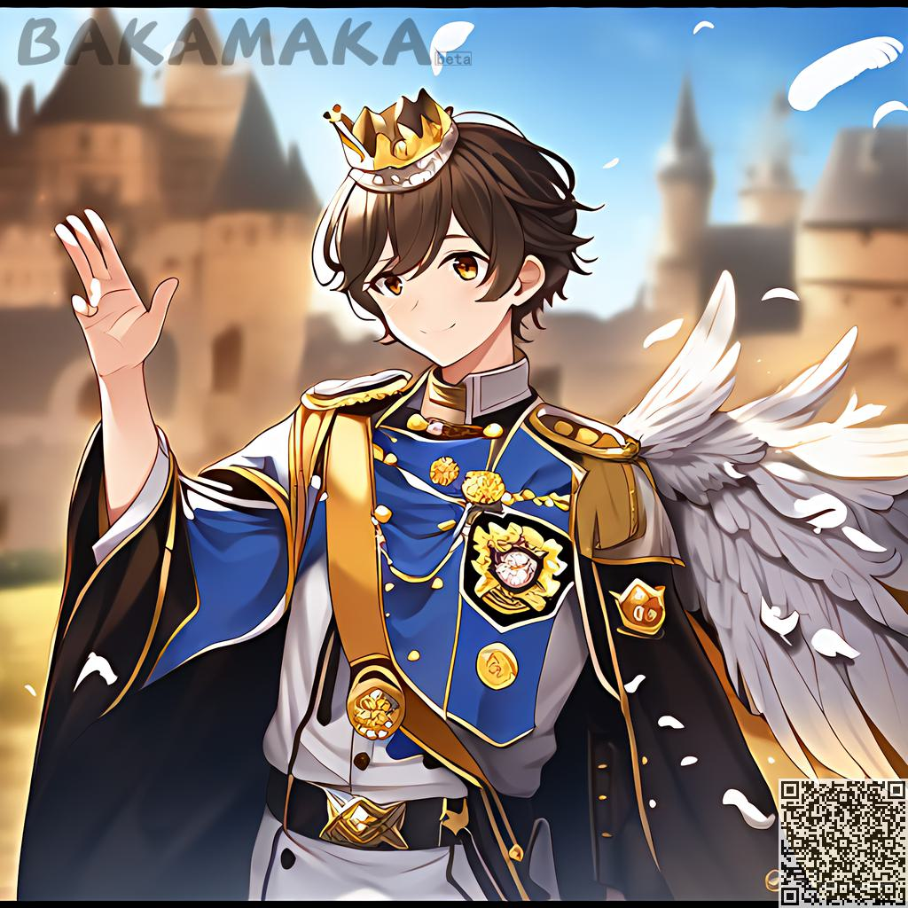

Prompt가이드
########################################

기본 문법：
:::::::::::::::::::::::::::::::::::::::::::::::::::::::::::::::::::::::::::::

전체 프롬프트는 쉼표로 구분된 N개의 태그로 구성되며, 각 태그는 현재 이미지에 대한 설명에 속합니다.

기본 문자에 대한 전체 프롬프트 생성은 다음을 포함합니다.

  - ``【basic】`` ：성별, 머리, 옷과 같은 기본 사항
- 
  - ``【dynamic】`` ：방향, 신체 움직임, 표현

  - ``【object】`` ：장면에 있는 물체, 그림에 있는 부속품

  - ``【detail】`` ：위의 모든 세부 사항의 수준을 설명하십시오. 예를 들어, 물의 세부 사항, 섬세한 얼굴 등.

  - ``【special effects】`` ：동적 조명, 블룸, 확산, 속도 선 등의 장면에 대한 효과를 설명하는 데 사용됩니다.

보다 상세한 설명을 통해 요구 사항에 더 가까운 이미지가 생성됩니다.

.. code-block:: shell

    one girl, happy, long hair, red hair, suit, flowers

태그강조 기능:
:::::::::::::::::::::::::::::::::::::::::::::::::::::::::::::::::::::::::::::

특수 문구을 사용하여 태그를 강조하여 사진에서 일부 더 선명하게지게 만들 수 있습니다.

- ``{tag}`` : 태그의 가중치를 1.05배 늘리다.
- ``(tag)`` : 태그의 가중치를 1.1배로 늘립니다.
- ``[tag]`` :태그의 가중치를 1.05배 줄이다
  
여러 그룹의 응력 기호의 중첩은 곱셈으로 표현된다.

- ``{{tag}}`` : 해당 가중치의 1.05*1.05배로 증가
- ``((tag))`` : 해당 가중치의 1.1*1.1배로 증가
- ``[tag]`` : 해당 가중치의 1.05*1.05배 감소

태그:가중치 형식으로 고정 가중치를 지정할 수 있습니다.

- {tag: 1.5}, [tag: 1.5](tag: 1.5), (tag: 1.5) 모두 해당 태그의 가중치를 1.5배로 직접 설정하는 것을 나타냅니다. {}, [], ()를 더 추가하면 이 구문이 유효하지 않습니다.

각 태그 그룹은 다음과 같이 별도로 강조 표시되어야 합니다.

.. code-block:: shell

    one girl, happy, long hair, red hair, {suit}, {flowers}

오류 사례:

.. code-block:: shell

    one girl, happy, long hair, red hair, {suit, flowers}

.. note::

    가중치가 1.5를 초과하지 않는 것이 좋습니다. 그렇지 않으면 이미지의 전체적인 모양과 느낌에 영향을 미칩니다.

결과를 확인해 보겠습니다.

.. code-block:: shell

    one girl, happy, long hair, red hair, suit, {flowers：1.5}

.. image:: img/text2img_pic9.png
   :align: center
   :width: 300

시도해 보세요.
:::::::::::::::::::::::::::::::::::::::::::::::::::::::::::::::::::::::::::::

기본레벨
:::::::::::::::::::::::::::::::::::::::::::::::::::::::::::::::::::::::::::::

기본적인 문법 운영에 익숙해진 후, 우리는 우리만의 AI 창작물을 만들기 시작해야 한다.

예를 들어 전사를 원한다면:
^^^^^^^^^^^^^^^^^^^^^^^^^^^^^^^^^^^^^
.. code-block:: shell

    one boy, armor

.. image:: img/text2img_pic10.png
   :align: center
   :width: 300

망토를 입은 전사를 원한다면:
^^^^^^^^^^^^^^^^^^^^^^^^^^^^^^^^^^^^^
.. code-block:: shell

    one boy, armor, cloak

.. image:: img/text2img_pic11.png
   :align: center
   :width: 300

잠깐만, 내 날개는 어디 있지? 당황하지 마십시오. 태그 강조가 필요한 부분입니다.
^^^^^^^^^^^^^^^^^^^^^^^^^^^^^^^^^^^^^^^^^^^^^^^^^^^^^^^^^^^^^^^^^^^^^^^^^^^^^^^^^^^^^^^^^^^^^^^^^^^^^^^^^^^^^^^

.. code-block:: shell

    one boy, armor, cloak, feathered wings, crown

.. image:: img/text2img_pic13.png
   :align: center
   :width: 300

.. note::

    가중치 조정에 문제가 있거나 익숙하지 않은 경우 당사에서 제공하는 자동가중치 옵션을 사용해 보십시오.
    [자동 가중치 설정 시 수동으로 조절한 강조는 유효하지 않으므로 주의하시기 바랍니다!]

배경을 원하지 않으면 이렇게 할 수 있습니다.
^^^^^^^^^^^^^^^^^^^^^^^^^^^^^^^^^^^^^^^^^^^^^^^^^^^^^^^^^^^^^^^^^^^^^^^^^^^^^^^^^^^^^^^^^^^^^^^^^^^^^^^^^^^^^^^

.. code-block:: shell

    one girl,armor,official art,simple background, fire

.. image:: img/text2img_pic14.png
   :align: center
   :width: 300

당신의 애니메이션 장면을 원하십니까? 그런 다음 다음과 같이 입력하기만 하면 됩니다.
^^^^^^^^^^^^^^^^^^^^^^^^^^^^^^^^^^^^^^^^^^^^^^^^^^^^^^^^^^^^^^^^^^^^^^^^^^^^^^^^^^^^^^^^^^^^^^^^^^^^^^^^^^^^^^^

.. code-block:: shell

    a small 1girl holding an {umbrella} sitting alone on a {bench} after school. {{{masterpiece}}}, high quality, beautifully painted, pixiv, artstation hq, production art, comfort, [rain], reflective, dynamic light, cute, spring, 8k, {detailed face}, beautiful face, {bus stop}

.. image:: img/text2img_pic15.png
   :align: center
   :width: 300

.. code-block:: shell

    high quality background detailed sky {rainforest} anime fantasy hd magical rain woods view from ground dirt moss masterpiece {{hyper realistic}} night stars moon pond river small fireflies best quality clear resolution

.. image:: img/text2img_pic16.png
   :align: center
   :width: 300
   

망토와 왕관을 쓰고, 날래있는 전사 기초에 다듬다.
:::::::::::::::::::::::::::::::::::::::::::::::::::::::::::::::::::::::::::::

먼저 [Dynamic]을 추가합니다. 여기서 캐릭터는 카메라를 바라보며 미소를 지으며 한 손을 듭니다.

.. code-block:: shell

    one boy, armor, cloak, {feathered wings:1.3}, crown,Look at the camera, the characters smile and raise one hand

그런 다음 【object】, 【성】, 가슴에 배지를 추가합니다.

.. code-block:: shell

    one boy, armor, cloak, {feathered wings:1.4}, crown,Look at the camera, the characters smile and raise one hand,Castle, {badge on chest:1.3}

【detail】【special effects】 다시 추가, 섬세한 얼굴, 불꽃광, 확산, 거품, 떠다니는 깃털

.. code-block:: shell

    one boy, armor, cloak, {feathered wings:1.4}, crown,Look at the camera, the characters smile and raise one hand,Castle, {badge on chest:1.3},Exquisite face, flame glow, diffusion, foam, floating feathers

.. image:: img/cb_3.jpg
   :align: center
   :width: 300

.. note::

    여러 번 무작위로 원하는 그림을 많이 그릴 수 있습니다. 만약 계속 무작위로 올 수 없다면, 키워드가 정확하게 묘사되어 있는지 확인해 보십시오.
