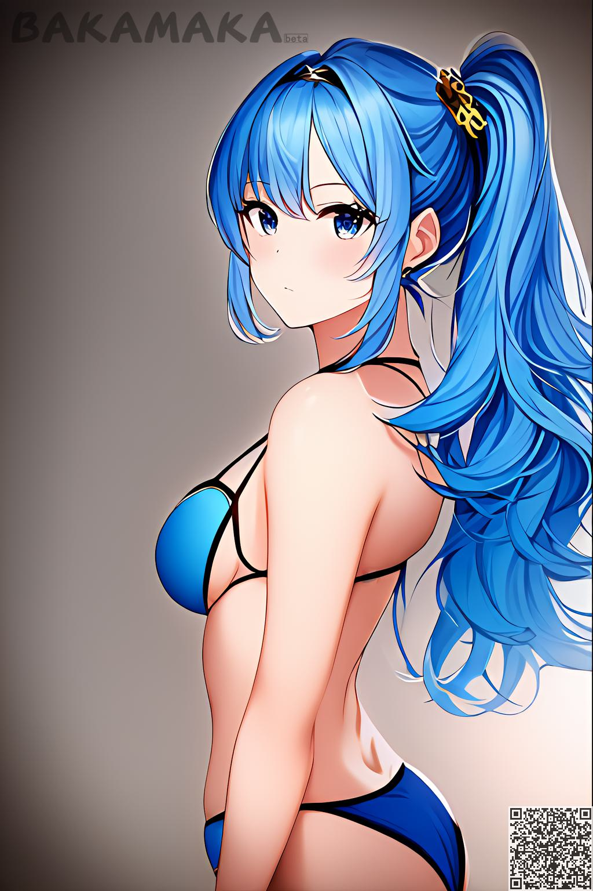
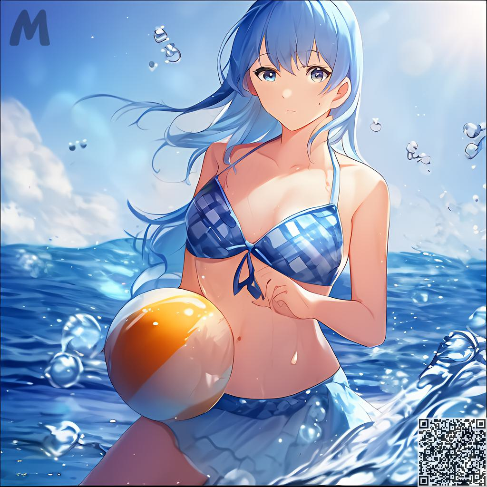

MAKA의 캐릭터나 장면을 구체화하는 방법？
########################################

.. note::
   
   이 튜토리얼은 여러분에게 그림을 그릴 수 있는 효과적인 방법론을 가르쳐 줄 것이며, 이 방법만으로 그림을 그릴 수 있는 것은 아닙니다.

1.일반 구조물 구축
=====================================

첫째로, 여러분은 마음속에 거친 장면과 캐릭터를 만들어야 합니다(아래 그림의 스타일처럼).

.. image:: img/text2img_pic28.png
   :align: center
   :width: 300

이 시점에서, 여러분은 마음속으로 단순한 묘사적인 단어를 상상할 수 있어야 합니다.

- 여자, 파란 머리, 파란 눈동자, 비키니 수영복

.. code-block:: shell

    A girl, blue hair, blue pupils, bikini

모두 비교적 간단합니다. 먼저 생성해 보겠습니다.

우리는 이와 같은 사진을 얻을 것입니다. 이것은 아직 초보적인 것입니다. 그러니 괜찮습니다. 새로운 문구를 추가해 봅시다.

2.자세한 설명 추가
=====================================

전체 구조가 성공적으로 구축되었습니다. 이제 우리는 수업을 다시 다루는 완전히 새로운 문구를 거기에 추가해야 합니다.

이를 위한 몇 가지 단계가 있습니다.

   1. 당신은 바다의 존재와 무엇을 연관시키나요? 바닷물, 코코넛 나무, 해변, 태양, 물보라, 거품, 파도

   2. 역동적인 빛, 떠다니는 머리카락, 보석 같은 눈, 확산, 서라운드와 같은 형용사를 베이스에 추가합니다.

   3. 카메라를 향해서 이 피사체에 역동성을 추가합니다.
   
마지막으로 다음을 확인할 수 있습니다. 

- 카메라를 마주하고, 디테일이 있는 아름다운 물, 거품, 코코넛 나무, 해변, 역동적인 빛, 떠다니는 머리카락, 햇빛, 물보라, 파도, 보석 같은 눈, 퍼짐, 서라운드

.. code-block:: shell

    Facing the camera, beautiful sea water with details, bubbles, coconuts, beaches, dynamic light, floating hair, sunlight, splash, waves, jewel like eyes, diffusion, surround

.. note::

    사용자가 선택할 수 있는 지침에 형용사를 추가하거나, 당사가 제공하는 사전 설정된 설명을 사용하여 형용사를 수정할 수 있습니다(건설 중).

설명적인 단어를 추가할 때, 우리는 당신이 염두에 두고 있는 시나리오에 무엇이 존재해야 하는지 상상해 볼 필요가 있다.

위와 같이 결과가 다시 생성됩니다.

이 시점에서 생성된 이미지가 대부분 조건을 충족했음을 알 수 있습니다.

3. 상세 내역에 대한 설명
=====================================

예를 들어, 긴 노란색 머리를 가진 이미지를 원하는 경우 파란색 머리에서 "긴 노란색 머리"라는 새로운 용어로 전환할 수 있습니다.

.. code-block:: shell

   A girl, Long yellow hair, blue pupils, bikini,Facing the camera, beautiful sea water with details, bubbles, coconuts, beaches, dynamic light, floating hair, sunlight, splash, waves, jewel like eyes, diffusion, surround

.. image:: img/cgc_3.jpg
   :align: center
   :width: 300

다른 건 몰라도 긴 머리 소녀의 사진이 있을 거야.、

마찬가지로 다른 내용을 생성하려는 경우 추가하거나 수정할 수 있습니다.

4.요약
=======================================================

생성 과정에서 하룻밤 사이에 성공하는 것을 상상하지 말고 아래 단계를 따르도록 노력하십시오.

- 등장인물의 일반적인 모습(성별, 머리, 옷 등)을 설명하는 것을 우선시한다.

- 방향 또는 신체 움직임을 포함한 캐릭터의 역동성을 설명합니다.

- 현장에 존재하는 물체(코코넛, 조개, 집 등)를 묘사한다.

- 세부적인 물, 실제 물, 떠다니는 머리카락 등 물체의 세부 수준을 설명합니다.

- 설명적 단어를 추가하거나 제거하려면 2-4를 반복합니다.

- 만족스러운 그림을 그리다