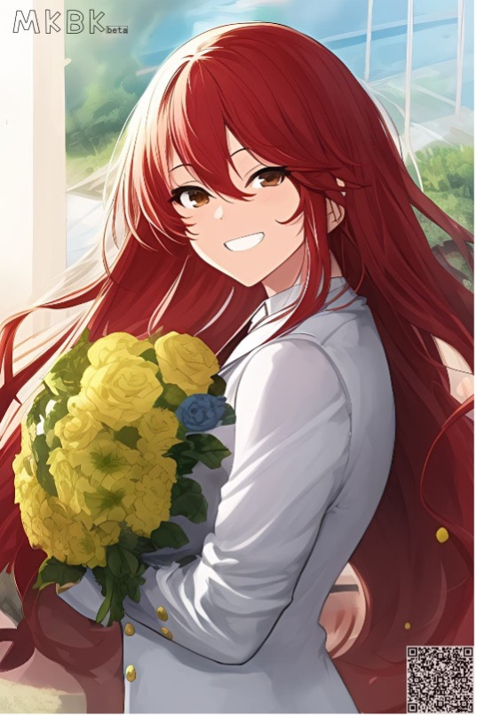
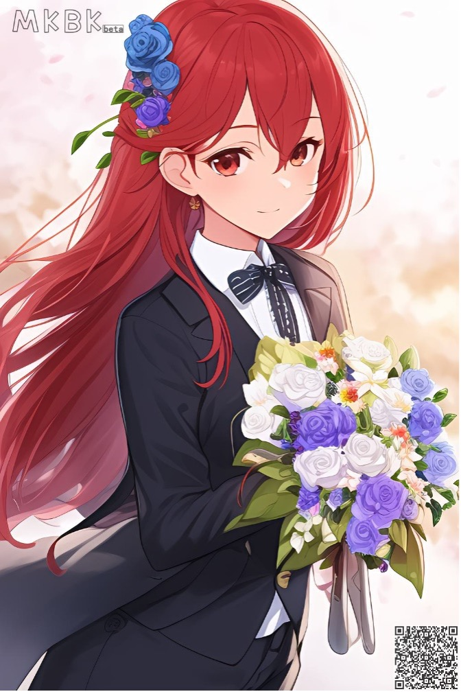
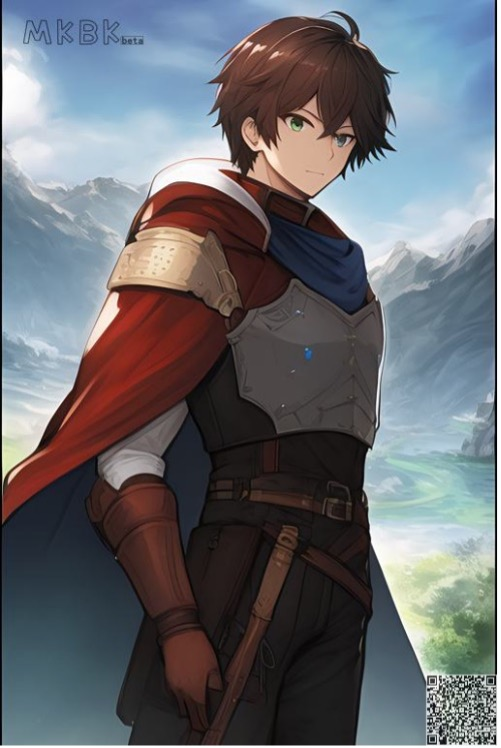
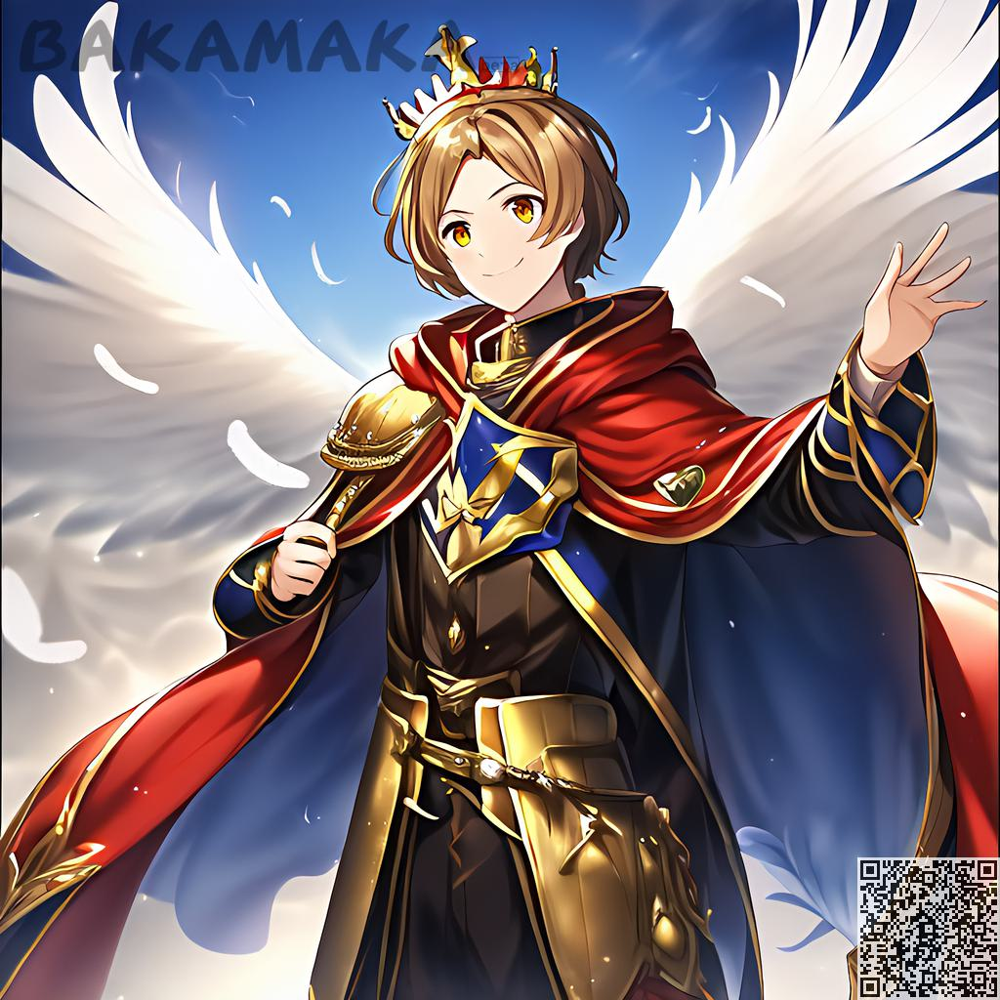
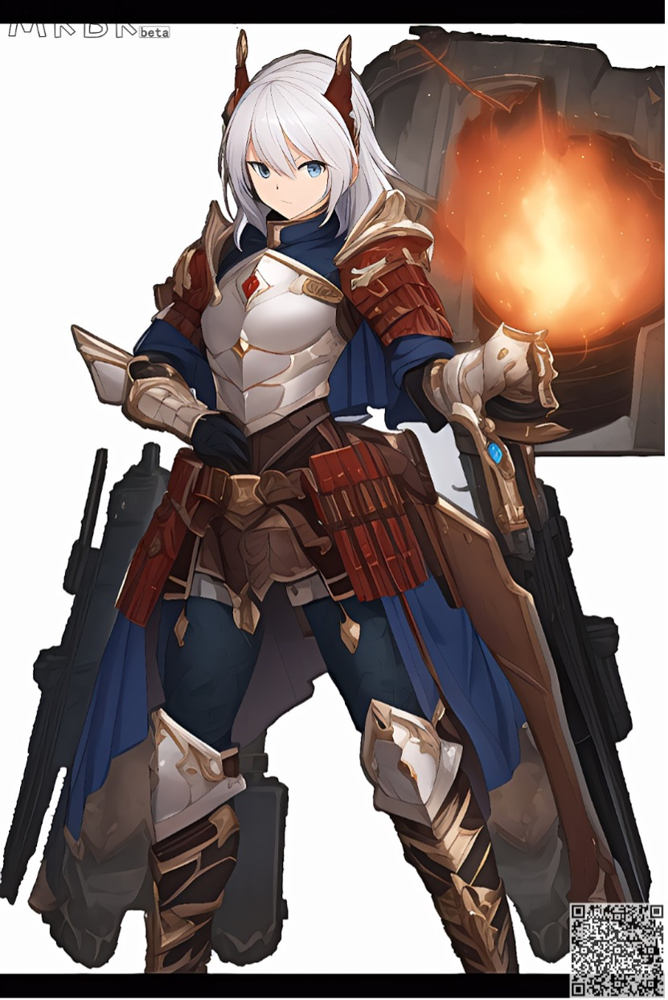
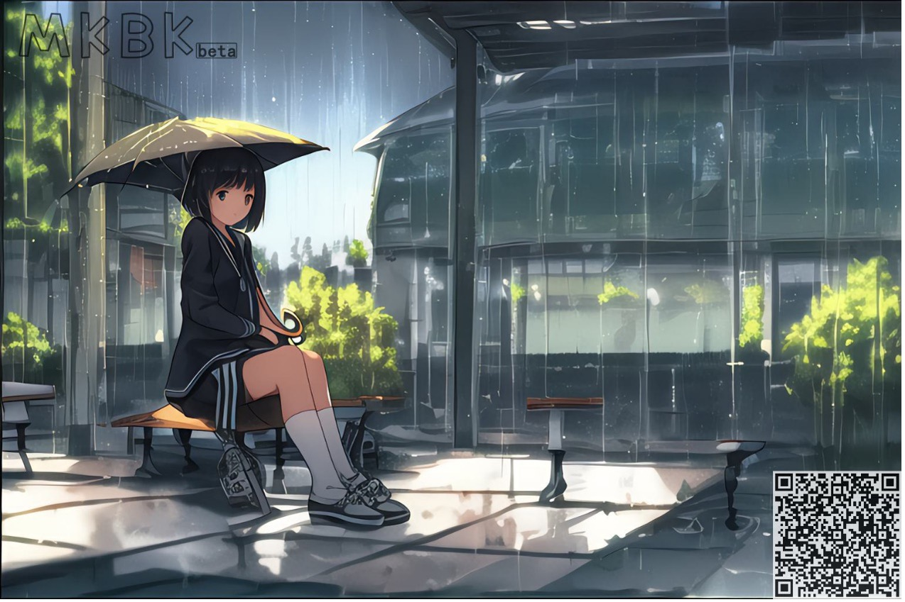
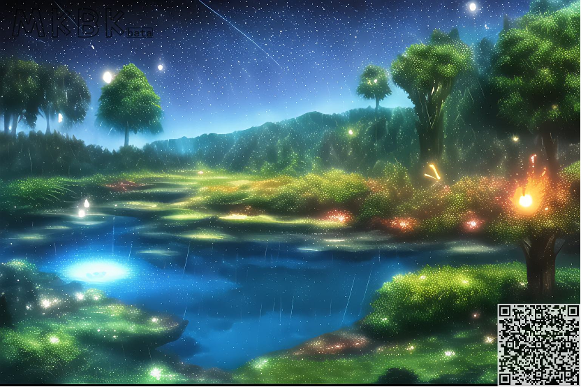
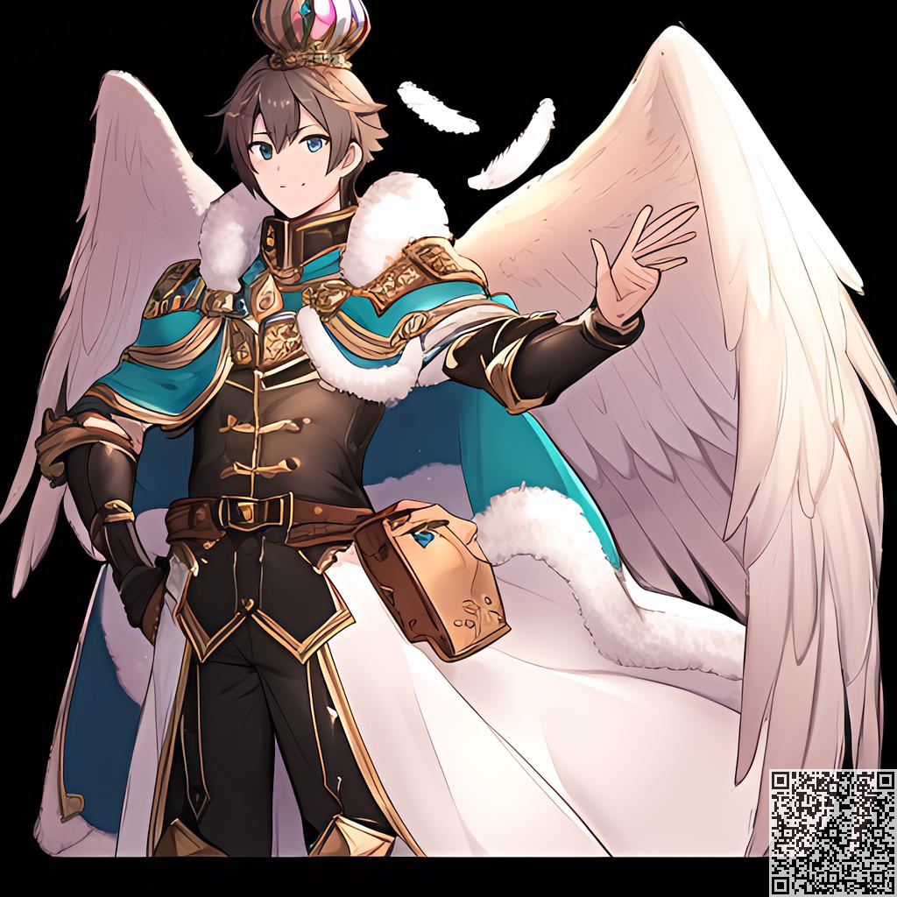

Prompt 教程
########################################

基础语法教程：
:::::::::::::::::::::::::::::::::::::::::::::::::::::::::::::::::::::::::::::

完整的prompt由N个tag组成，tag之间以逗号分割，每个tag属于一种对于当前图像的描述

针对基础人物的生成完整的prompt包括

  - ``【基础类】`` ：性别，头发，衣服等基础内容

  - ``【动态类】`` ：朝向，肢体动作，表情

  - ``【物件】`` ：场景上存在的物件，人物上存在的配件

  - ``【细致度】`` ：描述上述所有内容的细致程度，如 细节的水 ， 精致的脸庞 等

  - ``【特效】`` ：用于描述场景上的效果，如 动态光，BLOOM，扩散，速度线 等

细致的描述会使得生成的图像更加接近需求。

.. code-block:: shell

    如：one girl, happy, long hair, red hair, suit, flowers

TAG强调功能：
:::::::::::::::::::::::::::::::::::::::::::::::::::::::::::::::::::::::::::::

你可以通过一些特殊的语法强调你的某一些tag使得其在画面中更突出：

- ``{tag}`` : 将tag的权重放大 ``1.05`` 倍
- ``(tag)`` : 将tag的权重放大 ``1.1`` 倍
- ``[tag]`` :将tag的权重缩小 ``1.05`` 倍

多组强调符号的叠加以相乘的形式体现

- ``{{tag}}`` : 对应权重为 ``1.05*1.05`` 倍
- ``((tag))`` : 对应权重为 ``1.1*1.1`` 倍
- ``[tag]`` : 对应权重缩小 ``1.05*1.05`` 倍

你可以通过 tag:权重的形式指定固定权重

- {tag: 1.5}, [tag: 1.5], (tag: 1.5)，全部代表直接将该tag权重设置为1.5倍，在此语法下，添加更多的{},[],()无效；

每组tag需要单独强调，如

.. code-block:: shell

    one girl, happy, long hair, red hair, {suit}, {flowers}

错误示例：

.. code-block:: shell

    one girl, happy, long hair, red hair, {suit, flowers}

.. note::

    建议权重不要超过1.5，否则会影响整体画面观感。

我们来看一下效果吧：

.. code-block:: shell

    one girl, happy, long hair, red hair, suit, {flowers：1.5}

尝试一下
:::::::::::::::::::::::::::::::::::::::::::::::::::::::::::::::::::::::::::::

基础类
:::::::::::::::::::::::::::::::::::::::::::::::::::::::::::::::::::::::::::::

在熟悉了基础的语法操作之后，我们就要开始打造自己专属的AI创作啦，初入二次元，你需要一个量身定做的角色，我们就从普通的语法开始搭建啦。

如果你想要一个战士：
^^^^^^^^^^^^^^^^^^^^^^^^^^^^^^^^^^^^^
.. code-block:: shell

    one boy, armor

.. image:: img/text2img_pic10.png
   :align: center
   :width: 300

想要一个有 ``披风`` 的战士：
^^^^^^^^^^^^^^^^^^^^^^^^^^^^^^^^^^^^^
.. code-block:: shell

    one boy, armor, cloak

想要一个有披风，有 ``皇冠`` ， 有 ``翅膀`` 的战士：
^^^^^^^^^^^^^^^^^^^^^^^^^^^^^^^^^^^^^

.. code-block:: shell

    one boy, armor, cloak, feathered wings, crown

.. note::

    如果你觉得权重调整很麻烦或者不熟悉，请尝试我们提供的自动权重选项
    [开启自动权重后，手动调整的强调将无效，请谨慎使用！]

如果你不想要背景，那你可以这样做：
^^^^^^^^^^^^^^^^^^^^^^^^^^^^^^^^^^^^^

.. code-block:: shell

    one girl,armor,official art,simple background, fire

想要你的二次元动漫场景？那你只需要这样输入：
^^^^^^^^^^^^^^^^^^^^^^^^^^^^^^^^^^^^^

.. code-block:: shell

    a small 1girl holding an {umbrella} sitting alone on a {bench} after school. {{{masterpiece}}}, high quality, beautifully painted, pixiv, artstation hq, production art, comfort, [rain], reflective, dynamic light, cute, spring, 8k, {detailed face}, beautiful face, {bus stop}

.. code-block:: shell

    high quality background detailed sky {rainforest} anime fantasy hd magical rain woods view from ground dirt moss masterpiece {{hyper realistic}} night stars moon pond river small fireflies best quality clear resolution

   

有披风有皇冠，有翅膀的战士基础上细化
:::::::::::::::::::::::::::::::::::::::::::::::::::::::::::::::::::::::::::::

首先，我们增加【动态类】，人物看向镜头，人物微笑，单手举起

.. code-block:: shell

    one boy, armor, cloak, {feathered wings:1.3}, crown,Look at the camera, the characters smile and raise one hand

然后增加 【物件】，城堡，徽章在胸前

.. code-block:: shell

    one boy, armor, cloak, {feathered wings:1.4}, crown,Look at the camera, the characters smile and raise one hand,Castle, {badge on chest:1.3}

.. image:: img/cb_2.jpg
   :align: center
   :width: 300

再次添加 【细致度】【特效】，精致的脸庞，火焰光晕，扩散，泡沫，漂浮羽毛

.. code-block:: shell

    one boy, armor, cloak, {feathered wings:1.4}, crown,Look at the camera, the characters smile and raise one hand,Castle, {badge on chest:1.3},Exquisite face, flame glow, diffusion, foam, floating feathers

.. note::

    可多次随机多你认为满意的图片，如一直无法随机到，请查看下关键词描述的是否准确
