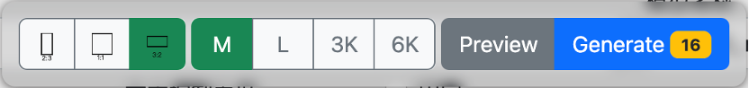
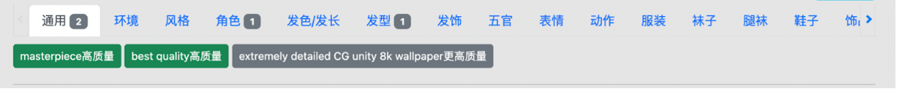
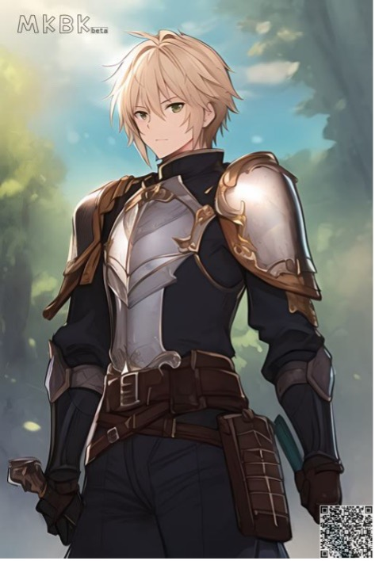

使用makabaka进行AI画画的4层境界
###############################

第一层——使用makabaka做一个AI画师1221
================================

makabaka主要分为五大块内容，分别是： 

#. 文生图：根据给定文字标签生成图片,

#. 图生图：根据给定图片进行二次创作，生成新的图片,

#. 局部魔改：给定一张图片，并对图片上想要修改的位置进行涂黑，AI会帮你生成新的修改,

#. 我的资料：包含用户的历史记录供查询 ,

#. 许愿池：大家可以积极提出修改建议，我们将会在这里实时更新。

文生图基础说明
^^^^^^^^^^^^^^^^^

点击进入文生图页面后，最上方是图片展示区域。用户生成的图片将会展示在这里。通过点击图片可以放大查看图片的细节。

.. image:: img/text2img_pic1.png
   :align: center

在最下方的浮空按钮组中，有三个部分组成，分别是

#. 图片长宽比选择：用户可以选择 ``2:3`` ， ``1:1`` ， ``3:2`` 这三种长宽比

#. 图片长边选择：不同选项代表生成图像的长边分辨率。其中，M代表768，L代表1536，3K代表3072，6K代表6144，分辨率越高的图像生成价格更高哦~

#. 生成按钮：左边的 Preview 按钮暂时不可用，右边的 Generate 代表生成。Generate旁边的小数字代表这次生成所需要耗费的点数。

用户在填写好“描述”之后，只需要点击 Generate 按钮即可生成图片。
在文生图中，用户可以通过在“描述”中输入不同词汇的组合来描述即将要生成的图片。描述可以通过选择已有预设，也可以自己编写。

随机生成一段描述（推荐新手使用）
^^^^^^^^^^^^^^^^^^^^^^^^^^^^^^^^^^^^^

点击random按钮，即可随机生成一段预设的描述，按下方的generate按钮，即可开始生成。

.. image:: img/text2img_pic3.png
   :align: center

使用已有预设进行生成（推荐新手使用）
^^^^^^^^^^^^^^^^^^^^^^^^^^^^^^^^^^^^^

在“描述”框的下侧，有一组分类以及对应的标签。通过点击选中下方的标签，用户可以将其添加到上方的“描述”框中。上方的每个类别旁边的小数字意味着所有用户使用该词汇的热度。

使用自己编写的描述生成图像（进入第二层境界必备技能）
^^^^^^^^^^^^^^^^^^^^^^^^^^^^^^^^^^^^^^^^^^^^^^^^^^^^^^^^^^^^^^^^^^^^^^^^^^^^^^^^^^^^^^^^^^^^^^

.. image:: img/text2img_pic5.png
   :align: center

用户可以自己编写英文描述进行图像生成，但需要注意的是AI有时候会对你的描述理解错误，导致生成的图像很奇怪，需要一些技巧，这些技巧将在第二层境界中进行介绍。自己编写“描述”需要遵守以下规则：

#. 不同词汇间需要用半角的逗号 “,” 来进行分隔。不需要出现句号。

#. 对于想要增强的词汇，通过增加大括号 {} 可以有效增加该词汇在生成过程中的权重。例如，想要多次增强 apple 这个词汇，可以写成 ``{{{apple}}}`` ，这样相当于我们对 apple 这个词汇做了三次增强。

#. 对于想要削弱的词汇，通过增加小括号 () 可以有效增加该词汇在生成过程中的权重。例如，想要多次增强 pear 这个词汇，可以写成 ``(((pear)))`` ，这样相当于我们对 pear 这个词汇做了三次增强。

#. 需要注意，削弱和增强均代表希望生成的内容要素，差别在于强调还是弱化。如果不希望图像中出现一些概念，则应写到“反向描述“栏中（反向描述需要点击 advanced 激活）

.. image:: img/text2img_pic6.png
   :align: center

makabaka 还提供了很多参数来对生成图片的数量和质量进行调整。点击 advanced 按钮即可展开。主要有以下部分组成：

#. 反向描述：在这里用户可以填写一些不像在图片中出现的词汇。和“描述”框的规则保持一致

#. 模型名称：用户可以选择想要使用的模型

#. 生成数量：用户可以选择想要生成的数量

#. 生成步数：用户可以定义每次生成过程中的前馈次数，一般在20左右

#. 文本控制力度：用于定义描述文本对生成图片的把控程度。一般在7左右

#. 固定：选中可以固定生成种子，使得两次生成的结果相同

#. 自动权重：选中后可以在生成过程中自动对描述中的部分词语进行加权，大大提高生成效果

.. image:: img/text2img_pic7.png
   :align: center

图生图基础说明
^^^^^^^^^^^^^^^^^^^^^^^^^^^^^^^^^^^^^^^^^^^^^^^

点击进入img2img页面后，用户首先需要做的是上传一张图片。点击browser按钮，选择本地图片后，点击最右侧的upload按钮，就可以上传图片。等待片刻后，用户上传的图片将会出现在最下方左边的图片栏中。之后的操作和在txt2img中一样，用户可以选择添加描述，修改参数，然后点击 Generate 按钮，即可查看生成图片。

局部魔改基础说明
^^^^^^^^^^^^^^^^^^^^^^^^^^^^^^^^^^^^^^^^^^^^^^^

点击进入inpaint页面后，和img2img一样，用户需要上传一张图片。上传之后，用户可以通过在图片上描黑一部分内容，来告诉AI想要重新生成的部分。点击生成以后，即可看到经过部分修改之后的图片。

点数系统说明
^^^^^^^^^^^^^^^^^^^^^^^^^^^^^^^^^^^^^^^^^^^^^^^

makabaka的世界通过 points（点数）来进行交易。现阶段下，每位用户初始化会给 1000 points。每次生成一张 M 等级大小的图片需要耗费 2 点数，L 等级对应是 4 点数，3K 等级对应是 8 点数，6K 等级对应是 16 点数。当点数不足时，用户无法提交新的生成任务，可以联系管理员或者充钱（暂时没有）。

第二层——编写属于自己的makabaka的描述
==============================================

基础语法教程
^^^^^^^^^^^^^^^^^^^^^^^^^^^^^^^^^^^^^^^^^^^^^^^

完整的prompt由N个tag组成，tag之间以逗号分割，每个tag属于一种对于当前图像的描述，

针对基础人物的生成完整的prompt包括【性别类】,【人物面部(含表情)】,【人物头发】,【人物服饰】,【其他装饰】 and 【其他】。细致的描述会使得生成的图像更加接近需求，这避免生成过程变成一个抽卡过程。

.. code-block:: shell

    如：one girl, happy, long hair, red hair, suit, flowers

.. image:: img/text2img_pic8.png
   :align: center

tag强调功能
^^^^^^^^^^^^^^^^^^^^^^^^^^^^^^^^^^^^^^^^^^^^^^^

你可以通过一些特殊的语法强调你的某一些tag使得其在画面中更突出：

 ``{tag}`` : 将tag的权重放大1.05倍，

 ``(tag)`` : 将tag的权重放大1.1倍， 

 ``[tag]`` :将tag的权重缩小1.05倍；

多组强调符号的叠加以相乘的形式体现，如 ``{{tag}}`` 对应权重为1.05*1.05倍；

你可以通过 ``tag:`` 权重的形式指定固定权重，如：

 ``{tag: 1.5}`` , ``[tag: 1.5]`` , ``(tag: 1.5)`` ，全部代表直接将该tag权重设置为1.5倍，在此语法下，添加更多的{},[],()无效；

每组tag需要单独强调，如

.. code-block:: shell

    one girl, happy, long hair, red hair, {suit}, {flowers}

错误示例：

.. code-block:: shell

    one girl, happy, long hair, red hair, {suit, flowers}

.. note::

    建议权重不要超过1.5，否则会影响整体画面观感。

我们来看一下效果吧：

.. code-block:: shell

    one girl, happy, long hair, red hair, suit, {flowers：1.5}

.. image:: img/text2img_pic9.png
   :align: center

生成基础参数说明
^^^^^^^^^^^^^^^^^^^^^^^^^^^^^^^^^^^^^^^^^^^^^^^   

- 描述：输入prompt，由N个tag组成；

- 生成数量：一次得到图像的数量；

- 生成步数：生成一张图的迭代次数，次数越大质量越高，但速度会越慢，建议20-40；

- 文本控制力度：生成图像与输入prompt的相关性程度，越大越相关，建议7-11之间 [ps：小一些的数值会给模型更大的发挥空间，有一些意想不到的结果，建议4-6]；

小白版生成指南
^^^^^^^^^^^^^^^^^^^^^^^^^^^^^^^^^^^^^^^^^^^^^^^ 

在熟悉了基础的语法操作之后，我们就要开始打造自己专属的AI创作啦，初入二次元，你需要一个量身定做的角色，我们就从普通的语法开始搭建啦。

如果你想要一个战士：

.. code-block:: shell

    one boy, armor

想要一个有披风的战士：

.. code-block:: shell

    one boy, armor, cloak

.. image:: img/text2img_pic11.png
   :align: center

想要一个有披风，有皇冠，有翅膀的战士：

.. code-block:: shell

    one boy, armor, cloak, feathered wings, crown

.. image:: img/text2img_pic12.png
   :align: center

！！！等一下，我的翅膀哪去了，不要慌，这个时候你就需要tag强调了：

.. code-block:: shell

    one boy, armor, cloak, {feathered wings:1.3}, crown

.. image:: img/text2img_pic13.png
   :align: center

.. note::

    如果你觉得权重调整很麻烦或者不熟悉，请尝试我们提供的自动权重选项
    [开启自动权重后，手动调整的强调将无效，请谨慎使用！]

如果你不想要背景，那你可以这样做：

.. code-block:: shell

    one girl,armor,official art,simple background, fire

.. image:: img/text2img_pic14.png
   :align: center

想要你的二次元动漫场景？那你只需要这样输入：

.. code-block:: shell

    a small 1girl holding an {umbrella} sitting alone on a {bench} after school. {{{masterpiece}}}, high quality, beautifully painted, pixiv, artstation hq, production art, comfort, [rain], reflective, dynamic light, cute, spring, 8k, {detailed face}, beautiful face, {bus stop}

.. image:: img/text2img_pic15.png
   :align: center

.. code-block:: shell

    high quality background detailed sky {rainforest} anime fantasy hd magical rain woods view from ground dirt moss masterpiece {{hyper realistic}} night stars moon pond river small fireflies best quality clear resolution

.. image:: img/text2img_pic16.png
   :align: center

第三层——AI画图大师才能拥有的“氛围感”
============================================

体验了基础功能之后，你一定想生成更精致的图像，一张精美的图像需要有对人物的描述，对背景风格的描述以及对于周围装饰物和气氛的描述。

那么就到了考验你对图像描述的能力了，话不多说，直接上咒语:

.. code-block:: shell

    one girl,Chinese style red ancient clothes,white hair,very long hair,bangs braid,red eyes,night,medium breasts,moon,forest,glowing butterflies,look forward,masterpiece,best quality

.. image:: img/text2img_pic17.png
   :align: center

.. image:: img/text2img_pic18.png
   :align: center

.. code-block:: shell

    Girl,photo,dynamic light,sunshine,highlight,masterpiece,sunset,exquisite girl,ASK,bloom,illustration,white hair,red eyes,cherry tree,ponytail,straw hat,dress,Genshin Impact,seashore,shell,distant view,mountain,exquisite golden beach,coconut tree with good texture,daytime,white clouds,thick coating,transparent,blue sea,seabirds,flowers,rocks,starfish,fruits,Seagull,butterfly,forest,crab,dolphin,lighthouse,reef,wild flower,banana,fill light,reflective,,best quality,official art,extremely detailed CG unity 8k wallpaper

.. image:: img/text2img_pic19.png
   :align: center

.. image:: img/text2img_pic20.png
   :align: center

如果你能清楚的描述你喜欢的角色，你会得到：

.. image:: img/text2img_pic21.png
   :align: center

第四层——人脑与AI合一，提升你的描述成功率
========================================================

在我们的用户讨论群中，众多AI画师们会分享他们的技巧与能力，欢迎加群讨论！

灵活运用场景构建与人物生成，充分解放你的想象力吧！！！！

.. code-block:: shell

    {{{2k, 4k, 8k, studio quality, photorealistic textures, lifelike textures, realistic shadows, realistic lighting, hyperrealistic, hyperdetailed}}}, {{{{white and red theme}}}}, {{{{1male (angel, white bangel wings, glowing halo above head, full body, holding glowing white weapon, white armor, white helmet, golden details)}}}}, {{{{{character focus}}}}}, {{{sharp focus}}}, {{{floating on air}}}, {{{hell theme, hell background, hell, fire, flames}}}, {{{facing away from viewer, white aura around character, white light particles around character, golden dust, golden sparks, golden sparkles, red sparks, red sparkles, white light pillar on character}}}, standing, from below, menacing

.. image:: img/text2img_pic22.png
   :align: center

.. code-block:: shell

    masterpiece, best quality, artbook, official art, ultra detailed, illustration, {{{1 girl}}}, {{{solo}}}, {{{wind}}}, {{{dynamic angle}}}, {{{10 years old}}}, disheveled hair, messy hair, beautiful delicate eyes gradation, bokeh, blur, motion blur, glitch, cinematic lighting, {{{beautiful delicate lenz flare}}}, beautiful delicate glow, beautiful delicate thick paint, {{{chubby}}}, {{{{{{gochuumon wa usagi desu ka}}}}}}, flat breasts, flat chest, beautiful delicate blue sky, many feathers floating in the air, {{{many beautiful detailed white birds}}}, {{{{{{many beautiful delicate petals in the air}}}}}}, sushi

.. image:: img/text2img_pic23.png
   :align: center  

.. code-block:: shell

    {{{{masterpiece, extremely detailed, cg unity 8k wallpaper, illustration, beautiful eyes, detailed eyes, best illumination, best shadows, ultra-detailed}}}}, {{1girl, looking at viewer}}, {{{depth of field}}}, {{{{photorealistic}}}}, {{{{{{dilated pupils}}}}}}, {{{{dragon girl, ice, scales, scale armor dress}}}}, medium breasts, short hair, {{{{white, blue eyes, blue hair}}}}, {{{{{dragon}}}}}, horns, {{{{{ice crystals, crystal, hair ornament}}}}}, {{{{{scales on face}}}}}, ice cavern.

.. image:: img/text2img_pic24.png
   :align: center   

.. image:: img/text2img_pic25.png
   :align: center 

.. code-block:: shell

    ((illustration)), ((floating hair)), ((chromatic aberration)), ((caustic)), lens flare, dynamic angle, ((portrait)), (1 girl), ((solo)), cute face, ((hidden hands)), asymmetrical bangs, (beautiful detailed eyes), eye shadow, ((huge clocks)), ((glass strips)), (floating glass fragments), ((colorful refraction)), (beautiful detailed sky), ((dark intense shadows)), ((cinematic lighting)), ((overexposure)), (expressionless), blank stare, big top sleeves, ((frills)), hair_ornament, ribbons, bowties, buttons, (((small breast))), pleated skirt, ((sharp focus)), ((masterpiece)), (((best quality))), ((extremely detailed)), colorful, hdr

.. image:: img/text2img_pic26.png
   :align: center   

最后召唤你的大师之作吧~~~~~~

.. image:: img/text2img_pic27.png
   :align: center 
