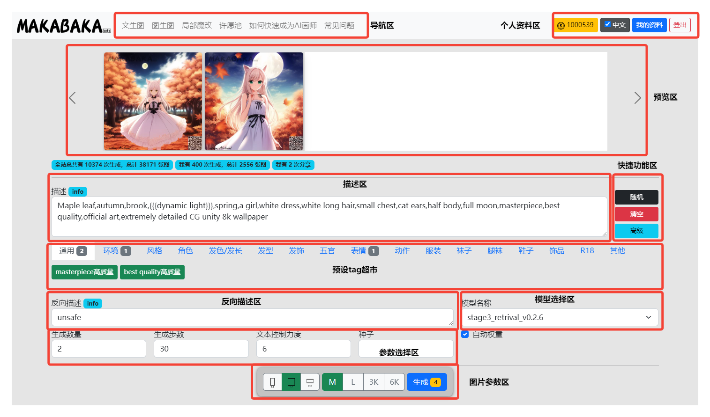

文生图操作界面简介
########################################

1.界面简介
----------------------------------------

** 导航区
=======================================

   - 文生图：通过描述词汇进行生成图片

   - 图生图：上传预设图片与描述词汇进行生成图片

   - 局部修改：通过选取部分区域与描述词汇进行生成图片

个人资料区
=======================================

   - 当前剩余**灵感点**数量

   - 语言切换

   - 我的资料：在查看历史生成记录

   - 登出

1.1 预览区
----------------------------------------

   - 这边将显示你生成的图片
   
   - 在首次打开页面时，这边将显示一些我们预设的图片

1.2 描述区
----------------------------------------

   - 这边可编辑与输入您想要描述词（`描述词相关教程 <Prompt_course.html>`_）

1.3 快捷功能区
----------------------------------------

   - 随机 ：此功能将随机一些官方认为较为不错“描述词”到描述区
   - 清空 ：点击此按钮将会直接将“描述区”内的所有描述词清空
   - 高级 ：点击可以 显示/隐藏 “反向描述区”，“模型选择区”，“参数选择区”，“图片参数区”

1.4 预设tag超市
----------------------------------------

 - 这边我们将预设部分预设的tag供用户选择

1.5 反向描述区
----------------------------------------

   - 这边可编辑与输入您想要描述词（`描述词相关教程 <Prompt_course.html>`_）

   - 此功能主要是在AI随机发挥时，可能会带上各种随机的内容，如果您不想他出现在您的画作中，就可以

1.6 模型选择区
----------------------------------------

   - 在这边可以选择不同风格的模型（当前只有一个模型可供选择）

1.7 参数选择区
----------------------------------------
   - 生成数量：单次生成的数量
   - 生成步数：单次计算步数，建议30-100
   - 文本控制力度：用于定义描述文本对生成图片的把控程度。一般在7左右
   - 种子：固定后，相同参数下，每次生成的图将相同
   - 自动权重：选中后可以在生成过程中自动对描述中的部分词语进行加权，大大提高生成效果

1.8 图片参数区
----------------------------------------

   - 图片长宽比选择：用户可以选择 2:3，1:1，3:2 这三种长宽比
   - 图片长边选择：不同选项代表生成图像的长边分辨率。其中，M代表768，L代表1536，3K代表3072，6K代表6144，分辨率越高的图像生成价格更高哦~
   - 生成按钮：生成。旁边的小数字代表这次生成所需要耗费的点数。

