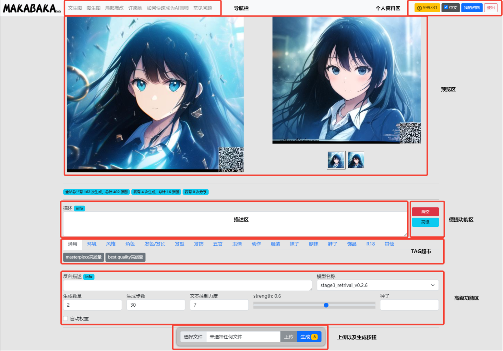

图生图操作界面简介
########################################

1.界面简介
----------------------------------------

** 导航区
=======================================

   - 文生图：通过描述词汇进行生成图片

   - 图生图：上传预设图片与描述词汇进行生成图片

   - 局部修改：通过选取部分区域与描述词汇进行生成图片

** 个人资料区
=======================================

   - 当前剩余**灵感点**数量

   - 语言切换

   - 我的资料：在查看历史生成记录

   - 登出

1.1 预览区
----------------------------------------

在预览区，您将可以预览到您上传的图片以及生成后的图片缩略图

- 在左侧将显示您上传的图片，默认状态下我们将提供一张Demo供您使用

- 在右侧将显示通过 ``描述`` 词汇 与 原先图片共同生成的最终图片

- 可通过右边下方切换多张图片

1.2 描述区
----------------------------------------

   - 这边可编辑与输入您想要描述词（`描述词相关教程 <Prompt_course.html>`_）

1.3 快捷功能区
----------------------------------------

   - 清空 ：点击此按钮将会直接将“描述区”内的所有描述词清空
   - 高级 ：点击可以 显示/隐藏 “反向描述区”，“模型选择区”，“参数选择区”，“图片参数区”

1.4 预设tag超市
----------------------------------------

 - 这边我们将预设部分预设的tag供用户选择

1.5 高级功能区
----------------------------------------

- 反向描述

   - 这边可编辑与输入您想要描述词（`描述词相关教程 <Prompt_course.html>`_）

   - 此功能主要是在AI随机发挥时，可能会带上各种随机的内容，如果您不想他出现在您的画作中，就可以在此地输入不想出现的内容

- 模型选择区

    - 在这边可以选择不同风格的模型（当前只有一个模型可供选择）

- 生成数量

    - 单次可生成的数量，数量越多消耗的时间以及 ``灵感点`` 也更多

- 生成步数

    - 单次计算步数，建议30-100，数值越大生成的图片将越精细，同样所消耗的时间也会更加多

- 文本控制力度

    - 用于定义描述文本对生成图片的把控程度。一般在7左右

- 种子

    - 固定后，相同参数下，每次生成的图将相同

- 自动权重

    - 选中后可以在生成过程中自动对描述中的部分词语进行加权，大大提高生成效果

- strength

    - 用于定义对对原先图片的修改力度， 数值越 ``大`` 力度越 ``高``

1.6 上传以及生成按钮
----------------------------------------

- 上传

    - 可通过此功能将图片上传到服务器，并在预览区展示

- 生成

    - 生成。旁边的小数字代表这次生成所需要耗费的点数

    - 点数与 生成图片的数量，生成图片的分辨率成正比